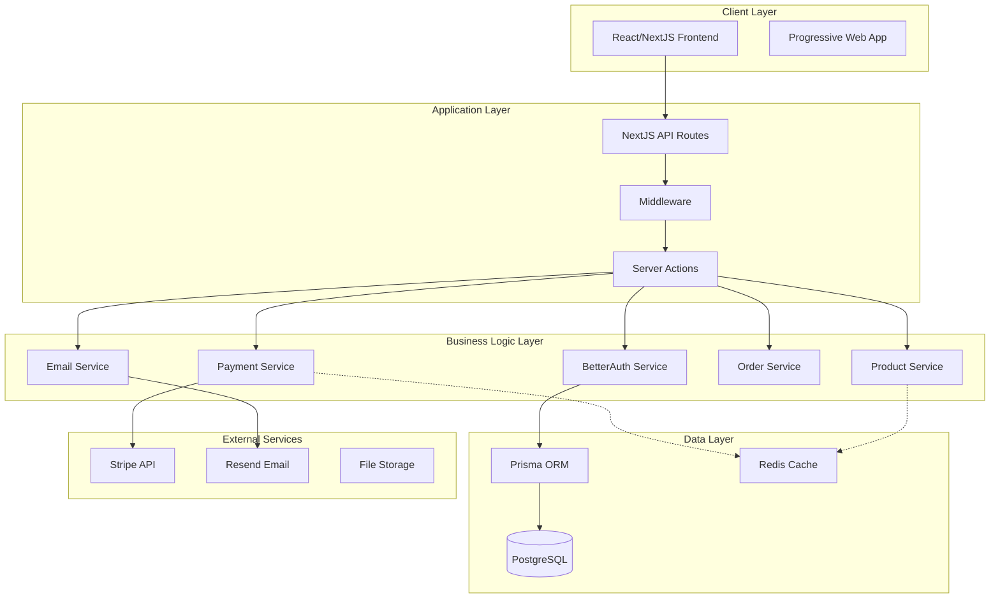
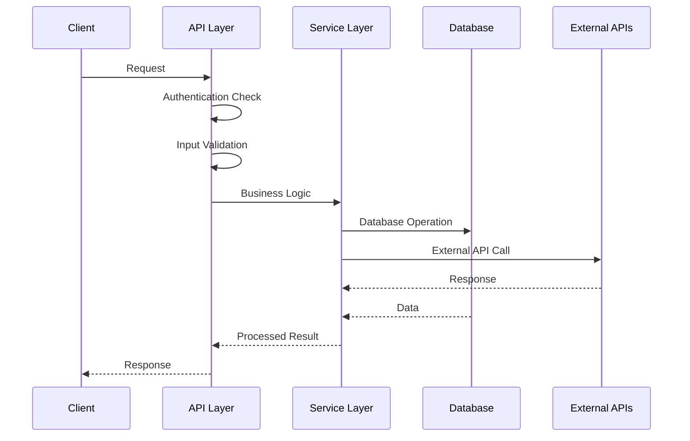
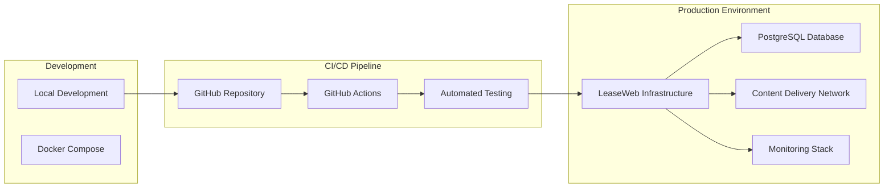

# System Overview & Architecture

## 1. High-Level Architecture

The NextJS Stripe Payment Template follows a modern full-stack architecture with clear separation of
concerns and scalable design patterns.

## 2. Core Architectural Principles

### 2.1 Separation of Concerns

- **Presentation Layer**: React components and UI logic
- **Application Layer**: NextJS API routes and server actions
- **Business Layer**: Domain services and business logic
- **Data Layer**: Database access and external integrations

### 2.2 Security-First Design

- Role-based access control (RBAC)
- PCI compliance for payment processing
- Secure session management
- Input validation and sanitization
- Rate limiting and DDoS protection

### 2.3 Scalability Patterns

- Horizontal scaling capability
- Caching strategies for performance
- Efficient database queries with proper indexing
- Stateless API design
- Event-driven architecture for webhooks

## 3. Technology Stack Justification

### 3.1 Frontend Stack

- **NextJS 14+**: Full-stack React framework with App Router
  - Server-side rendering for SEO and performance
  - Built-in API routes for backend functionality
  - Optimized bundling and code splitting
- **TypeScript**: Type safety and better developer experience
- **Shadcn UI**: Modern, accessible component library
- **Zod**: Runtime type validation and form handling
- **next-safe-action**: Type-safe server actions

### 3.2 Backend Stack

- **NextJS API Routes**: Serverless-ready backend
- **Prisma**: Type-safe database access and migrations
- **BetterAuth**: Modern authentication solution
- **PostgreSQL**: ACID-compliant relational database

### 3.3 External Services

- **Stripe**: Industry-standard payment processing
- **Resend**: Reliable email delivery service
- **LeaseWeb**: European hosting provider

## 4. System Boundaries

### 4.1 Internal Systems

- User authentication and authorization
- Product catalog management
- Order processing and fulfillment
- Subscription lifecycle management
- Analytics and reporting

### 4.2 External Integrations

- Payment processing (Stripe)
- Email communications (Resend)
- File storage (optional CDN)
- Monitoring and logging services

## 5. Data Flow Architecture

## 6. Performance Requirements

### 6.1 Response Times

- **Page Load**: < 3 seconds initial load
- **API Responses**: < 500ms for standard operations
- **Database Queries**: < 100ms average
- **Payment Processing**: < 2 seconds end-to-end

### 6.2 Throughput

- **Concurrent Users**: 1000+ simultaneous users
- **API Requests**: 10,000+ requests per minute
- **Payment Volume**: 1000+ transactions per hour

### 6.3 Availability

- **Uptime Target**: 99.9% (8.77 hours downtime per year)
- **Recovery Time**: < 15 minutes for critical failures
- **Backup Strategy**: Daily automated backups with point-in-time recovery

## 7. Security Architecture Overview

### 7.1 Authentication Flow

1. User registration/login through BetterAuth
2. Session token generation and management
3. Role-based access control enforcement
4. Secure logout and session invalidation

### 7.2 Payment Security

1. PCI DSS compliance through Stripe
2. No storage of sensitive payment data
3. Secure tokenization for stored payment methods
4. Webhook signature verification

### 7.3 Data Protection

1. Encryption at rest for sensitive data
2. HTTPS/TLS for data in transit
3. Input sanitization and validation
4. SQL injection prevention through Prisma

## 8. Monitoring and Observability

### 8.1 Application Monitoring

- Performance metrics and alerts
- Error tracking and reporting
- User behavior analytics
- Business metrics (MRR, churn, etc.)

### 8.2 Infrastructure Monitoring

- Server performance and health
- Database performance optimization
- Network latency and throughput
- Security event monitoring

## 9. Deployment Architecture

## 10. Risk Assessment and Mitigation

### 10.1 Technical Risks

- **Stripe API Changes**: Version pinning and comprehensive testing
- **Database Performance**: Query optimization and caching strategies
- **Security Vulnerabilities**: Regular security audits and updates

### 10.2 Business Risks

- **Compliance Requirements**: PCI DSS and data protection compliance
- **Scalability Limits**: Horizontal scaling and load balancing
- **Vendor Dependencies**: Fallback strategies for critical services

## 11. Next Steps

1. **Database Schema Design** - Detailed Prisma schema definition
2. **API Specification** - Complete endpoint documentation
3. **Security Implementation** - Authentication and authorization flows
4. **Team Structure** - Specialist roles and responsibilities
5. **Component Architecture** - Frontend/backend component breakdown
6. **Deployment Strategy** - Infrastructure and CI/CD implementation
