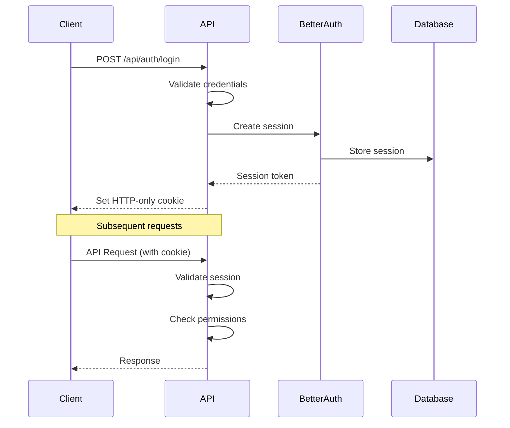

# API Specification & Integration Points

## 1. API Architecture Overview

The API follows RESTful principles with additional support for Server Actions in NextJS 14+. All APIs are implemented using NextJS API routes with TypeScript and comprehensive validation.

### 1.1 API Design Principles

- **RESTful Design**: Standard HTTP methods and status codes
- **Type Safety**: Full TypeScript coverage with Zod validation
- **Authentication**: Session-based auth with role-based access control
- **Rate Limiting**: Protection against abuse and DoS attacks
- **Error Handling**: Consistent error response format
- **Versioning**: API versioning strategy for future updates

### 1.2 Base API Structure

```
/api/
├── auth/                 # Authentication endpoints
├── users/               # User management
├── products/            # Product catalog
├── orders/              # Order processing
├── subscriptions/       # Subscription management
├── payments/            # Payment processing
├── discounts/           # Discount management
├── admin/               # Admin-only endpoints
├── webhooks/            # External service webhooks
└── health/              # System health checks
```

## 2. Authentication & Authorization

### 2.1 Authentication Flow



### 2.2 Authentication Endpoints

```typescript
// POST /api/auth/register
interface RegisterRequest {
  email: string;
  password: string;
  name: string;
  firstName?: string;
  lastName?: string;
}

interface RegisterResponse {
  success: boolean;
  user: {
    id: string;
    email: string;
    name: string;
    role: UserRole;
  };
  message: string;
}

// POST /api/auth/login
interface LoginRequest {
  email: string;
  password: string;
  rememberMe?: boolean;
}

interface LoginResponse {
  success: boolean;
  user: {
    id: string;
    email: string;
    name: string;
    role: UserRole;
  };
  redirectUrl?: string;
}

// POST /api/auth/logout
interface LogoutResponse {
  success: boolean;
  message: string;
}

// POST /api/auth/forgot-password
interface ForgotPasswordRequest {
  email: string;
}

// POST /api/auth/reset-password
interface ResetPasswordRequest {
  token: string;
  password: string;
}

// GET /api/auth/me
interface CurrentUserResponse {
  user: {
    id: string;
    email: string;
    name: string;
    role: UserRole;
    avatar?: string;
    subscription?: {
      status: string;
      currentPeriodEnd: string;
    };
  } | null;
}
```

### 2.3 Authorization Middleware

```typescript
// middleware/auth.ts
import { NextRequest, NextResponse } from 'next/server';
import { auth } from '@/lib/auth';

export async function authMiddleware(request: NextRequest) {
  const session = await auth.api.getSession({ request });
  
  // Public routes
  const publicRoutes = ['/api/health', '/api/webhooks'];
  if (publicRoutes.some(route => request.nextUrl.pathname.startsWith(route))) {
    return NextResponse.next();
  }
  
  // Require authentication
  if (!session) {
    return NextResponse.json({ error: 'Unauthorized' }, { status: 401 });
  }
  
  // Role-based access control
  const adminRoutes = ['/api/admin'];
  if (adminRoutes.some(route => request.nextUrl.pathname.startsWith(route))) {
    if (session.user.role !== 'ADMIN') {
      return NextResponse.json({ error: 'Forbidden' }, { status: 403 });
    }
  }
  
  return NextResponse.next();
}
```

## 3. Product Management API

### 3.1 Product Endpoints

```typescript
// GET /api/products
interface ProductListQuery {
  page?: number;
  limit?: number;
  category?: string;
  type?: ProductType;
  featured?: boolean;
  search?: string;
}

interface ProductListResponse {
  products: ProductWithPrices[];
  pagination: {
    page: number;
    limit: number;
    total: number;
    totalPages: number;
  };
}

// GET /api/products/[slug]
interface ProductDetailResponse {
  product: ProductWithPrices & {
    reviews: ProductReview[];
    averageRating: number;
    reviewCount: number;
  };
}

// POST /api/products (Admin only)
interface CreateProductRequest {
  name: string;
  description: string;
  shortDescription?: string;
  type: ProductType;
  basePrice: number;
  billingInterval?: 'month' | 'year';
  trialDays?: number;
  images?: string[];
  categoryIds?: string[];
}

// PUT /api/products/[id] (Admin only)
interface UpdateProductRequest extends Partial<CreateProductRequest> {
  status?: ProductStatus;
}

// DELETE /api/products/[id] (Admin only)
interface DeleteProductResponse {
  success: boolean;
  message: string;
}
```

### 3.2 Product Categories API

```typescript
// GET /api/products/categories
interface CategoryListResponse {
  categories: Array<{
    id: string;
    name: string;
    slug: string;
    description?: string;
    productCount: number;
    children?: CategoryListResponse['categories'];
  }>;
}

// POST /api/products/categories (Admin only)
interface CreateCategoryRequest {
  name: string;
  description?: string;
  parentId?: string;
}
```

## 4. Order Management API

### 4.1 Order Processing

```typescript
// POST /api/orders
interface CreateOrderRequest {
  items: Array<{
    productId: string;
    priceId: string;
    quantity: number;
  }>;
  billingAddress: BillingAddress;
  shippingAddress?: ShippingAddress;
  discountCode?: string;
}

interface CreateOrderResponse {
  order: {
    id: string;
    orderNumber: string;
    totalAmount: number;
    status: OrderStatus;
  };
  paymentIntent?: {
    id: string;
    clientSecret: string;
  };
  redirectUrl?: string; // For subscription checkout
}

// GET /api/orders
interface OrderListQuery {
  page?: number;
  limit?: number;
  status?: OrderStatus;
  userId?: string; // Admin only
}

interface OrderListResponse {
  orders: Array<{
    id: string;
    orderNumber: string;
    status: OrderStatus;
    totalAmount: number;
    createdAt: string;
    items: OrderItem[];
  }>;
  pagination: PaginationInfo;
}

// GET /api/orders/[id]
interface OrderDetailResponse {
  order: OrderWithItems & {
    refunds: Refund[];
    downloadUrls?: Array<{
      productId: string;
      url: string;
      expiresAt: string;
    }>;
  };
}

// POST /api/orders/[id]/refund (Admin/Support only)
interface RefundRequest {
  amount?: number; // Partial refund amount
  reason: RefundReason;
  notes?: string;
}
```

## 5. Payment Processing API

### 5.1 Stripe Integration

```typescript
// POST /api/payments/create-intent
interface CreatePaymentIntentRequest {
  orderId: string;
  paymentMethodId?: string;
  savePaymentMethod?: boolean;
}

interface CreatePaymentIntentResponse {
  clientSecret: string;
  publishableKey: string;
}

// POST /api/payments/confirm
interface ConfirmPaymentRequest {
  paymentIntentId: string;
}

interface ConfirmPaymentResponse {
  success: boolean;
  order: {
    id: string;
    status: OrderStatus;
    downloadUrls?: DownloadUrl[];
  };
}

// GET /api/payments/methods
interface PaymentMethodsResponse {
  paymentMethods: Array<{
    id: string;
    type: string;
    card?: {
      brand: string;
      last4: string;
      expMonth: number;
      expYear: number;
    };
    isDefault: boolean;
  }>;
}

// POST /api/payments/methods
interface AddPaymentMethodRequest {
  paymentMethodId: string; // From Stripe Elements
  setAsDefault?: boolean;
}

// DELETE /api/payments/methods/[id]
interface RemovePaymentMethodResponse {
  success: boolean;
  message: string;
}
```

### 5.2 Subscription API

```typescript
// POST /api/subscriptions
interface CreateSubscriptionRequest {
  priceId: string;
  paymentMethodId?: string;
  trialDays?: number;
  discountCode?: string;
}

interface CreateSubscriptionResponse {
  subscription: {
    id: string;
    status: SubscriptionStatus;
    currentPeriodEnd: string;
    trialEnd?: string;
  };
  paymentIntent?: {
    clientSecret: string;
  };
}

// GET /api/subscriptions
interface SubscriptionListResponse {
  subscriptions: Array<{
    id: string;
    product: Product;
    price: Price;
    status: SubscriptionStatus;
    currentPeriodStart: string;
    currentPeriodEnd: string;
    cancelAtPeriodEnd: boolean;
  }>;
}

// PUT /api/subscriptions/[id]
interface UpdateSubscriptionRequest {
  priceId?: string; // Change plan
  cancelAtPeriodEnd?: boolean;
  trialEnd?: string;
}

// DELETE /api/subscriptions/[id]
interface CancelSubscriptionRequest {
  immediately?: boolean;
  reason?: string;
}

// POST /api/subscriptions/[id]/reactivate
interface ReactivateSubscriptionResponse {
  success: boolean;
  subscription: Subscription;
}
```

## 6. User Management API

### 6.1 User Profile

```typescript
// GET /api/users/profile
interface UserProfileResponse {
  user: {
    id: string;
    email: string;
    name: string;
    firstName?: string;
    lastName?: string;
    phone?: string;
    avatar?: string;
    billingAddress?: BillingAddress;
    createdAt: string;
  };
}

// PUT /api/users/profile
interface UpdateProfileRequest {
  name?: string;
  firstName?: string;
  lastName?: string;
  phone?: string;
  avatar?: string;
  billingAddress?: BillingAddress;
}

// PUT /api/users/password
interface ChangePasswordRequest {
  currentPassword: string;
  newPassword: string;
}

// DELETE /api/users/account
interface DeleteAccountRequest {
  password: string;
  reason?: string;
}
```

### 6.2 Admin User Management

```typescript
// GET /api/admin/users
interface AdminUserListQuery {
  page?: number;
  limit?: number;
  role?: UserRole;
  status?: UserStatus;
  search?: string;
}

interface AdminUserListResponse {
  users: Array<{
    id: string;
    email: string;
    name: string;
    role: UserRole;
    status: UserStatus;
    createdAt: string;
    lastLoginAt?: string;
    orderCount: number;
    totalSpent: number;
  }>;
  pagination: PaginationInfo;
}

// PUT /api/admin/users/[id]
interface AdminUpdateUserRequest {
  role?: UserRole;
  status?: UserStatus;
  notes?: string;
}

// POST /api/admin/users/[id]/impersonate
interface ImpersonateUserResponse {
  success: boolean;
  token: string;
  redirectUrl: string;
}
```

## 7. Admin Analytics API

### 7.1 Dashboard Metrics

```typescript
// GET /api/admin/analytics/overview
interface AnalyticsOverviewResponse {
  metrics: {
    totalRevenue: number;
    monthlyRecurringRevenue: number;
    totalCustomers: number;
    activeSubscriptions: number;
    churnRate: number;
    averageOrderValue: number;
  };
  revenueChart: Array<{
    date: string;
    revenue: number;
    subscriptionRevenue: number;
    oneTimeRevenue: number;
  }>;
  topProducts: Array<{
    id: string;
    name: string;
    revenue: number;
    orderCount: number;
  }>;
}

// GET /api/admin/analytics/revenue
interface RevenueAnalyticsQuery {
  startDate: string;
  endDate: string;
  interval: 'day' | 'week' | 'month';
}

interface RevenueAnalyticsResponse {
  data: Array<{
    date: string;
    revenue: number;
    orders: number;
    subscriptions: number;
  }>;
  summary: {
    totalRevenue: number;
    growth: number;
    averageDaily: number;
  };
}

// GET /api/admin/analytics/customers
interface CustomerAnalyticsResponse {
  acquisition: Array<{
    date: string;
    newCustomers: number;
    churnedCustomers: number;
  }>;
  segments: Array<{
    segment: string;
    count: number;
    revenue: number;
  }>;
  cohortAnalysis: Array<{
    cohort: string;
    month0: number;
    month1: number;
    month2: number;
    month3: number;
  }>;
}
```

## 8. Webhook Integration

### 8.1 Stripe Webhooks

```typescript
// POST /api/webhooks/stripe
interface StripeWebhookHandler {
  // Handle various Stripe events
  'payment_intent.succeeded': (event: PaymentIntentSucceeded) => Promise<void>;
  'payment_intent.payment_failed': (event: PaymentIntentFailed) => Promise<void>;
  'customer.subscription.created': (event: SubscriptionCreated) => Promise<void>;
  'customer.subscription.updated': (event: SubscriptionUpdated) => Promise<void>;
  'customer.subscription.deleted': (event: SubscriptionDeleted) => Promise<void>;
  'invoice.payment_succeeded': (event: InvoicePaymentSucceeded) => Promise<void>;
  'invoice.payment_failed': (event: InvoicePaymentFailed) => Promise<void>;
}

// Webhook validation
async function validateStripeWebhook(request: NextRequest): Promise<boolean> {
  const signature = request.headers.get('stripe-signature');
  const payload = await request.text();
  
  try {
    stripe.webhooks.constructEvent(
      payload,
      signature,
      process.env.STRIPE_WEBHOOK_SECRET
    );
    return true;
  } catch (error) {
    return false;
  }
}
```

### 8.2 Internal Webhooks

```typescript
// POST /api/webhooks/internal/order-completed
interface OrderCompletedWebhook {
  orderId: string;
  userId: string;
  totalAmount: number;
  items: OrderItem[];
}

// POST /api/webhooks/internal/subscription-trial-ending
interface TrialEndingWebhook {
  subscriptionId: string;
  userId: string;
  trialEndDate: string;
  productName: string;
}
```

## 9. Email Service Integration

### 9.1 Email API with Resend

```typescript
// POST /api/emails/send
interface SendEmailRequest {
  template: EmailTemplate;
  to: string;
  data: Record<string, any>;
}

enum EmailTemplate {
  WELCOME = 'welcome',
  ORDER_CONFIRMATION = 'order-confirmation',
  PAYMENT_RECEIPT = 'payment-receipt',
  SUBSCRIPTION_CREATED = 'subscription-created',
  SUBSCRIPTION_CANCELLED = 'subscription-cancelled',
  TRIAL_ENDING = 'trial-ending',
  PAYMENT_FAILED = 'payment-failed',
  PASSWORD_RESET = 'password-reset',
}

// Email service implementation
class EmailService {
  private resend: Resend;
  
  constructor() {
    this.resend = new Resend(process.env.RESEND_API_KEY);
  }
  
  async sendWelcomeEmail(user: User): Promise<void> {
    await this.resend.emails.send({
      from: 'noreply@yourapp.com',
      to: user.email,
      subject: 'Welcome to Our Platform!',
      react: WelcomeEmailTemplate({ userName: user.name }),
    });
  }
  
  async sendOrderConfirmation(order: OrderWithItems): Promise<void> {
    await this.resend.emails.send({
      from: 'orders@yourapp.com',
      to: order.user.email,
      subject: `Order Confirmation - ${order.orderNumber}`,
      react: OrderConfirmationTemplate({ order }),
    });
  }
}
```

## 10. API Error Handling

### 10.1 Standard Error Response Format

```typescript
interface APIError {
  error: string;
  message: string;
  code?: string;
  details?: Record<string, any>;
  timestamp: string;
  requestId: string;
}

// Error handler middleware
export function errorHandler(error: Error, req: NextRequest): Response {
  const errorResponse: APIError = {
    error: error.name || 'InternalServerError',
    message: error.message || 'An unexpected error occurred',
    timestamp: new Date().toISOString(),
    requestId: req.headers.get('x-request-id') || generateRequestId(),
  };
  
  // Log error for monitoring
  console.error('API Error:', {
    ...errorResponse,
    stack: error.stack,
    url: req.url,
    method: req.method,
  });
  
  // Return appropriate status code
  let statusCode = 500;
  if (error instanceof ValidationError) statusCode = 400;
  if (error instanceof AuthenticationError) statusCode = 401;
  if (error instanceof AuthorizationError) statusCode = 403;
  if (error instanceof NotFoundError) statusCode = 404;
  
  return Response.json(errorResponse, { status: statusCode });
}
```

### 10.2 Common Error Types

```typescript
export class ValidationError extends Error {
  constructor(message: string, public field?: string) {
    super(message);
    this.name = 'ValidationError';
  }
}

export class AuthenticationError extends Error {
  constructor(message: string = 'Authentication required') {
    super(message);
    this.name = 'AuthenticationError';
  }
}

export class AuthorizationError extends Error {
  constructor(message: string = 'Insufficient permissions') {
    super(message);
    this.name = 'AuthorizationError';
  }
}

export class StripeError extends Error {
  constructor(message: string, public stripeCode?: string) {
    super(message);
    this.name = 'StripeError';
  }
}
```

## 11. Rate Limiting & Security

### 11.1 Rate Limiting Configuration

```typescript
// Rate limiting rules
const rateLimitConfig = {
  '/api/auth/login': { windowMs: 15 * 60 * 1000, max: 5 }, // 5 attempts per 15 minutes
  '/api/auth/register': { windowMs: 60 * 60 * 1000, max: 3 }, // 3 registrations per hour
  '/api/payments': { windowMs: 60 * 1000, max: 10 }, // 10 payment requests per minute
  '/api/products': { windowMs: 60 * 1000, max: 100 }, // 100 requests per minute
  default: { windowMs: 60 * 1000, max: 60 }, // Default: 60 requests per minute
};

// Rate limiter middleware
export async function rateLimiter(
  request: NextRequest,
  identifier: string
): Promise<boolean> {
  const path = request.nextUrl.pathname;
  const config = rateLimitConfig[path] || rateLimitConfig.default;
  
  // Implementation using Redis or in-memory store
  const key = `rate_limit:${identifier}:${path}`;
  const current = await redis.incr(key);
  
  if (current === 1) {
    await redis.expire(key, config.windowMs / 1000);
  }
  
  return current <= config.max;
}
```

### 11.2 Input Validation

```typescript
// Validation middleware using Zod
import { z } from 'zod';

export function validateRequest<T>(schema: z.ZodSchema<T>) {
  return async (request: NextRequest): Promise<T> => {
    const body = await request.json();
    
    try {
      return schema.parse(body);
    } catch (error) {
      if (error instanceof z.ZodError) {
        throw new ValidationError(
          'Invalid request data',
          error.errors[0]?.path?.join('.') || 'unknown'
        );
      }
      throw error;
    }
  };
}

// Usage example
const createProductSchema = z.object({
  name: z.string().min(1).max(255),
  description: z.string().min(10),
  basePrice: z.number().positive(),
  type: z.enum(['ONE_TIME', 'SUBSCRIPTION', 'DIGITAL_DOWNLOAD', 'SERVICE']),
});

// In API route
export async function POST(request: NextRequest) {
  const data = await validateRequest(createProductSchema)(request);
  // Process validated data...
}
```

## 12. API Testing Strategy

### 12.1 Unit Tests for API Routes

```typescript
// __tests__/api/products.test.ts
import { GET, POST } from '@/app/api/products/route';
import { createMocks } from 'node-mocks-http';

describe('/api/products', () => {
  it('should return products list', async () => {
    const { req, res } = createMocks({
      method: 'GET',
      query: { page: '1', limit: '10' },
    });
    
    const response = await GET(req);
    const data = await response.json();
    
    expect(response.status).toBe(200);
    expect(data.products).toBeArray();
    expect(data.pagination).toBeDefined();
  });
  
  it('should create new product (admin only)', async () => {
    const productData = {
      name: 'Test Product',
      description: 'Test description',
      basePrice: 29.99,
      type: 'ONE_TIME',
    };
    
    const { req } = createMocks({
      method: 'POST',
      body: productData,
      headers: {
        authorization: 'Bearer admin-token',
      },
    });
    
    const response = await POST(req);
    const data = await response.json();
    
    expect(response.status).toBe(201);
    expect(data.product.name).toBe(productData.name);
  });
});
```

### 12.2 Integration Tests with Stripe

```typescript
// __tests__/integration/stripe.test.ts
import { stripe } from '@/lib/stripe';

describe('Stripe Integration', () => {
  it('should create payment intent', async () => {
    const paymentIntent = await stripe.paymentIntents.create({
      amount: 2999,
      currency: 'usd',
      metadata: { orderId: 'test-order' },
    });
    
    expect(paymentIntent.status).toBe('requires_payment_method');
    expect(paymentIntent.amount).toBe(2999);
  });
  
  it('should handle webhook events', async () => {
    const event = {
      type: 'payment_intent.succeeded',
      data: { object: { id: 'pi_test', status: 'succeeded' } },
    };
    
    const result = await handleStripeWebhook(event);
    expect(result.success).toBe(true);
  });
});
```

This comprehensive API specification provides the foundation for implementing all required endpoints and integrations for the NextJS Stripe Payment Template.