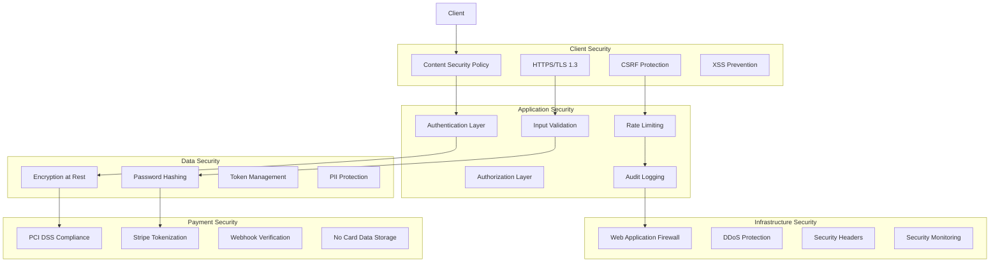

# Security Architecture & Implementation

## 1. Security Architecture Overview

The NextJS Stripe Payment Template implements a comprehensive security framework designed to protect
user data, payment information, and system integrity while maintaining PCI DSS compliance.

### 1.1 Security Principles

- **Defense in Depth**: Multiple layers of security controls
- **Zero Trust**: Verify everything, trust nothing
- **Principle of Least Privilege**: Minimal required permissions
- **Data Protection**: Encryption at rest and in transit
- **Compliance First**: PCI DSS, GDPR, and privacy regulations

### 1.2 Security Architecture Diagram



## 2. Authentication Security

### 2.1 BetterAuth Implementation

```typescript
// lib/auth.ts
import { betterAuth } from "better-auth";
import { prismaAdapter } from "better-auth/adapters/prisma";
import { prisma } from "./prisma";

export const auth = betterAuth({
  database: prismaAdapter(prisma, {
    provider: "postgresql",
  }),
  emailAndPassword: {
    enabled: true,
    requireEmailVerification: true,
    minPasswordLength: 8,
    maxPasswordLength: 128,
  },
  session: {
    expiresIn: 60 * 60 * 24 * 7, // 7 days
    updateAge: 60 * 60 * 24, // 1 day
    cookieCache: {
      enabled: true,
      maxAge: 60 * 5, // 5 minutes
    },
  },
  advanced: {
    crossSubDomainCookies: {
      enabled: false, // Disable for security
    },
    useSecureCookies: process.env.NODE_ENV === "production",
  },
  rateLimit: {
    enabled: true,
    window: 60, // 1 minute
    max: 100, // 100 requests per minute
  },
});
```

### 2.2 Password Security

```typescript
// lib/password.ts
import bcrypt from "bcryptjs";
import { z } from "zod";

// Password strength validation
export const passwordSchema = z
  .string()
  .min(8, "Password must be at least 8 characters")
  .max(128, "Password must not exceed 128 characters")
  .refine((password) => {
    // At least one uppercase letter
    if (!/[A-Z]/.test(password)) return false;
    // At least one lowercase letter
    if (!/[a-z]/.test(password)) return false;
    // At least one digit
    if (!/\d/.test(password)) return false;
    // At least one special character
    if (!/[!@#$%^&*(),.?":{}|<>]/.test(password)) return false;
    // No common patterns
    const commonPatterns = [
      /123456/,
      /password/,
      /qwerty/,
      /admin/,
      /letmein/,
      /welcome/,
      /monkey/,
      /dragon/,
    ];
    return !commonPatterns.some((pattern) => pattern.test(password.toLowerCase()));
  }, "Password must contain uppercase, lowercase, digit, special character, and no common patterns");

export class PasswordService {
  private static readonly SALT_ROUNDS = 12;

  static async hash(password: string): Promise<string> {
    // Validate password strength
    passwordSchema.parse(password);

    // Generate salt and hash
    const salt = await bcrypt.genSalt(this.SALT_ROUNDS);
    return bcrypt.hash(password, salt);
  }

  static async verify(password: string, hash: string): Promise<boolean> {
    return bcrypt.compare(password, hash);
  }

  static async needsRehash(hash: string): Promise<boolean> {
    // Check if hash was created with current salt rounds
    const rounds = hash.split("$")[2];
    return parseInt(rounds) < this.SALT_ROUNDS;
  }
}
```

### 2.3 Session Security

```typescript
// lib/session.ts
import { SignJWT, jwtVerify } from "jose";
import { NextRequest } from "next/server";

interface SessionPayload {
  userId: string;
  role: string;
  iat: number;
  exp: number;
  jti: string; // JWT ID for revocation
}

export class SessionManager {
  private static secret = new TextEncoder().encode(process.env.JWT_SECRET!);

  static async createSession(userId: string, role: string): Promise<string> {
    const jti = crypto.randomUUID();

    // Store session in database for revocation capability
    await prisma.session.create({
      data: {
        id: jti,
        userId,
        expiresAt: new Date(Date.now() + 7 * 24 * 60 * 60 * 1000), // 7 days
        ipAddress: getClientIP(),
        userAgent: getUserAgent(),
      },
    });

    return new SignJWT({ userId, role, jti })
      .setProtectedHeader({ alg: "HS256" })
      .setIssuedAt()
      .setExpirationTime("7d")
      .setAudience("nextjs-stripe-template")
      .setIssuer("nextjs-stripe-template")
      .sign(this.secret);
  }

  static async validateSession(token: string): Promise<SessionPayload | null> {
    try {
      const { payload } = await jwtVerify(token, this.secret, {
        audience: "nextjs-stripe-template",
        issuer: "nextjs-stripe-template",
      });

      // Check if session exists and is not revoked
      const session = await prisma.session.findUnique({
        where: { id: payload.jti as string },
      });

      if (!session || session.expiresAt < new Date()) {
        return null;
      }

      return payload as SessionPayload;
    } catch {
      return null;
    }
  }

  static async revokeSession(jti: string): Promise<void> {
    await prisma.session.delete({
      where: { id: jti },
    });
  }

  static async revokeAllUserSessions(userId: string): Promise<void> {
    await prisma.session.deleteMany({
      where: { userId },
    });
  }
}
```

## 3. Authorization & Access Control

### 3.1 Role-Based Access Control (RBAC)

```typescript
// lib/rbac.ts
export enum Permission {
  // Product permissions
  PRODUCT_READ = "product:read",
  PRODUCT_CREATE = "product:create",
  PRODUCT_UPDATE = "product:update",
  PRODUCT_DELETE = "product:delete",

  // Order permissions
  ORDER_READ = "order:read",
  ORDER_READ_ALL = "order:read:all",
  ORDER_UPDATE = "order:update",
  ORDER_REFUND = "order:refund",

  // User permissions
  USER_READ = "user:read",
  USER_UPDATE = "user:update",
  USER_DELETE = "user:delete",
  USER_IMPERSONATE = "user:impersonate",

  // Admin permissions
  ADMIN_DASHBOARD = "admin:dashboard",
  ADMIN_ANALYTICS = "admin:analytics",
  ADMIN_CONFIG = "admin:config",

  // Support permissions
  SUPPORT_DASHBOARD = "support:dashboard",
  SUPPORT_TICKETS = "support:tickets",
}

export const rolePermissions: Record<UserRole, Permission[]> = {
  [UserRole.ADMIN]: [
    Permission.PRODUCT_READ,
    Permission.PRODUCT_CREATE,
    Permission.PRODUCT_UPDATE,
    Permission.PRODUCT_DELETE,
    Permission.ORDER_READ,
    Permission.ORDER_READ_ALL,
    Permission.ORDER_UPDATE,
    Permission.ORDER_REFUND,
    Permission.USER_READ,
    Permission.USER_UPDATE,
    Permission.USER_DELETE,
    Permission.USER_IMPERSONATE,
    Permission.ADMIN_DASHBOARD,
    Permission.ADMIN_ANALYTICS,
    Permission.ADMIN_CONFIG,
    Permission.SUPPORT_DASHBOARD,
    Permission.SUPPORT_TICKETS,
  ],
  [UserRole.SUPPORT]: [
    Permission.PRODUCT_READ,
    Permission.ORDER_READ,
    Permission.ORDER_READ_ALL,
    Permission.ORDER_REFUND,
    Permission.USER_READ,
    Permission.SUPPORT_DASHBOARD,
    Permission.SUPPORT_TICKETS,
  ],
  [UserRole.CUSTOMER]: [
    Permission.PRODUCT_READ,
    Permission.ORDER_READ, // Own orders only
    Permission.USER_READ, // Own profile only
    Permission.USER_UPDATE, // Own profile only
  ],
};

export class AuthorizationService {
  static hasPermission(userRole: UserRole, permission: Permission): boolean {
    return rolePermissions[userRole]?.includes(permission) || false;
  }

  static checkPermission(userRole: UserRole, permission: Permission): void {
    if (!this.hasPermission(userRole, permission)) {
      throw new AuthorizationError(`Insufficient permissions for ${permission}`);
    }
  }

  static async canAccessResource(
    userId: string,
    userRole: UserRole,
    resource: string,
    resourceId?: string
  ): Promise<boolean> {
    // Admin can access everything
    if (userRole === UserRole.ADMIN) return true;

    // Resource-specific access control
    switch (resource) {
      case "order":
        if (userRole === UserRole.SUPPORT) return true;
        if (userRole === UserRole.CUSTOMER && resourceId) {
          const order = await prisma.order.findUnique({
            where: { id: resourceId },
            select: { userId: true },
          });
          return order?.userId === userId;
        }
        return false;

      case "user":
        if (userRole === UserRole.SUPPORT && resourceId !== userId) return false;
        return resourceId === userId;

      default:
        return false;
    }
  }
}
```

### 3.2 Middleware Authorization

```typescript
// middleware/authorize.ts
import { NextRequest, NextResponse } from "next/server";
import { auth } from "@/lib/auth";
import { AuthorizationService, Permission } from "@/lib/rbac";

export function requirePermission(permission: Permission) {
  return async function (request: NextRequest) {
    const session = await auth.api.getSession({ request });

    if (!session) {
      return NextResponse.json({ error: "Unauthorized" }, { status: 401 });
    }

    if (!AuthorizationService.hasPermission(session.user.role, permission)) {
      return NextResponse.json({ error: "Forbidden" }, { status: 403 });
    }

    return NextResponse.next();
  };
}

export function requireResourceAccess(
  resource: string,
  getResourceId?: (req: NextRequest) => string
) {
  return async function (request: NextRequest) {
    const session = await auth.api.getSession({ request });

    if (!session) {
      return NextResponse.json({ error: "Unauthorized" }, { status: 401 });
    }

    const resourceId = getResourceId?.(request);
    const canAccess = await AuthorizationService.canAccessResource(
      session.user.id,
      session.user.role,
      resource,
      resourceId
    );

    if (!canAccess) {
      return NextResponse.json({ error: "Forbidden" }, { status: 403 });
    }

    return NextResponse.next();
  };
}
```

## 4. Input Validation & Sanitization

### 4.1 Comprehensive Validation Layer

```typescript
// lib/validation.ts
import { z } from "zod";
import DOMPurify from "isomorphic-dompurify";

// Custom validation schemas
export const sanitizedString = z.string().transform((val) => DOMPurify.sanitize(val));

export const emailSchema = z
  .string()
  .email("Invalid email format")
  .max(254, "Email too long")
  .toLowerCase()
  .transform((email) => email.trim());

export const phoneSchema = z
  .string()
  .regex(/^\+?[1-9]\d{1,14}$/, "Invalid phone number format")
  .optional();

export const currencyAmountSchema = z
  .number()
  .positive("Amount must be positive")
  .multipleOf(0.01, "Amount must have at most 2 decimal places")
  .max(999999.99, "Amount too large");

export const slugSchema = z
  .string()
  .min(1)
  .max(100)
  .regex(/^[a-z0-9-]+$/, "Slug must contain only lowercase letters, numbers, and hyphens")
  .refine(
    (slug) => !slug.startsWith("-") && !slug.endsWith("-"),
    "Slug cannot start or end with hyphen"
  );

// SQL injection prevention
export function sanitizeForDatabase(input: string): string {
  // Remove SQL keywords and dangerous characters
  return input
    .replace(/['";\\]/g, "") // Remove quotes and backslashes
    .replace(/\b(SELECT|INSERT|UPDATE|DELETE|DROP|CREATE|ALTER|EXEC|UNION|OR|AND)\b/gi, "") // Remove SQL keywords
    .trim();
}

// XSS prevention
export function sanitizeHTML(html: string): string {
  return DOMPurify.sanitize(html, {
    ALLOWED_TAGS: ["p", "br", "strong", "em", "u", "ol", "ul", "li"],
    ALLOWED_ATTR: [],
  });
}
```

### 4.2 Request Validation Middleware

```typescript
// middleware/validation.ts
import { z } from "zod";
import { NextRequest } from "next/server";

export function validateRequest<TBody, TQuery, TParams>(schemas: {
  body?: z.ZodSchema<TBody>;
  query?: z.ZodSchema<TQuery>;
  params?: z.ZodSchema<TParams>;
}) {
  return async function (request: NextRequest) {
    try {
      let validatedData: any = {};

      // Validate request body
      if (schemas.body) {
        const body = await request.json();
        validatedData.body = schemas.body.parse(body);
      }

      // Validate query parameters
      if (schemas.query) {
        const query = Object.fromEntries(request.nextUrl.searchParams);
        validatedData.query = schemas.query.parse(query);
      }

      // Validate URL parameters
      if (schemas.params) {
        const url = new URL(request.url);
        const pathSegments = url.pathname.split("/").filter(Boolean);
        // Extract params based on route pattern
        validatedData.params = schemas.params.parse({
          // Implementation depends on route structure
        });
      }

      // Attach validated data to request
      (request as any).validated = validatedData;
    } catch (error) {
      if (error instanceof z.ZodError) {
        return Response.json(
          {
            error: "Validation Error",
            message: "Invalid request data",
            details: error.errors,
          },
          { status: 400 }
        );
      }
      throw error;
    }
  };
}
```

## 5. Payment Security (PCI DSS Compliance)

### 5.1 Stripe Security Implementation

```typescript
// lib/stripe-security.ts
import Stripe from "stripe";
import crypto from "crypto";

export class StripeSecurityService {
  private stripe: Stripe;

  constructor() {
    this.stripe = new Stripe(process.env.STRIPE_SECRET_KEY!, {
      apiVersion: "2024-06-20",
      typescript: true,
    });
  }

  // Verify webhook signatures
  static verifyWebhookSignature(payload: string, signature: string, secret: string): boolean {
    try {
      const stripe = new Stripe(process.env.STRIPE_SECRET_KEY!);
      stripe.webhooks.constructEvent(payload, signature, secret);
      return true;
    } catch (error) {
      console.error("Webhook signature verification failed:", error);
      return false;
    }
  }

  // Securely create payment intent
  async createSecurePaymentIntent(params: {
    amount: number;
    currency: string;
    customerId?: string;
    orderId: string;
    userEmail: string;
  }): Promise<Stripe.PaymentIntent> {
    return this.stripe.paymentIntents.create({
      amount: params.amount,
      currency: params.currency,
      customer: params.customerId,
      metadata: {
        orderId: params.orderId,
        userEmail: params.userEmail,
        timestamp: Date.now().toString(),
      },
      // Security settings
      confirmation_method: "manual",
      capture_method: "automatic",
      setup_future_usage: params.customerId ? "off_session" : undefined,
    });
  }

  // Validate payment intent ownership
  async validatePaymentIntentOwnership(paymentIntentId: string, userId: string): Promise<boolean> {
    try {
      const paymentIntent = await this.stripe.paymentIntents.retrieve(paymentIntentId);

      // Check if the payment intent belongs to the user's order
      const order = await prisma.order.findUnique({
        where: {
          stripePaymentIntentId: paymentIntentId,
          userId: userId,
        },
      });

      return !!order;
    } catch {
      return false;
    }
  }
}

// Never store payment card data
export const PCIComplianceRules = {
  // Rule: Never log or store sensitive card data
  sanitizeLogData: (data: any) => {
    const sensitiveFields = [
      "card_number",
      "cvv",
      "cvc",
      "exp_month",
      "exp_year",
      "account_number",
      "routing_number",
      "ssn",
      "tax_id",
    ];

    const sanitized = { ...data };
    sensitiveFields.forEach((field) => {
      if (sanitized[field]) {
        sanitized[field] = "[REDACTED]";
      }
    });

    return sanitized;
  },

  // Rule: Use HTTPS for all payment-related communications
  enforceHTTPS: (request: NextRequest) => {
    if (
      process.env.NODE_ENV === "production" &&
      request.headers.get("x-forwarded-proto") !== "https"
    ) {
      throw new Error("HTTPS required for payment operations");
    }
  },
};
```

### 5.2 Secure Token Management

```typescript
// lib/token-security.ts
export class TokenSecurityService {
  private static readonly TOKEN_ENTROPY = 32; // 256 bits
  private static readonly TOKEN_EXPIRY = 15 * 60 * 1000; // 15 minutes

  // Generate cryptographically secure tokens
  static generateSecureToken(): string {
    return crypto.randomBytes(this.TOKEN_ENTROPY).toString("hex");
  }

  // Create password reset token
  static async createPasswordResetToken(userId: string): Promise<string> {
    const token = this.generateSecureToken();
    const hashedToken = crypto.createHash("sha256").update(token).digest("hex");

    await prisma.passwordResetToken.create({
      data: {
        userId,
        token: hashedToken,
        expiresAt: new Date(Date.now() + this.TOKEN_EXPIRY),
      },
    });

    return token; // Return unhashed token for email
  }

  // Verify and consume password reset token
  static async verifyPasswordResetToken(token: string): Promise<string | null> {
    const hashedToken = crypto.createHash("sha256").update(token).digest("hex");

    const resetToken = await prisma.passwordResetToken.findFirst({
      where: {
        token: hashedToken,
        expiresAt: { gt: new Date() },
        used: false,
      },
    });

    if (!resetToken) return null;

    // Mark token as used
    await prisma.passwordResetToken.update({
      where: { id: resetToken.id },
      data: { used: true },
    });

    return resetToken.userId;
  }

  // Create email verification token
  static async createEmailVerificationToken(email: string): Promise<string> {
    const token = this.generateSecureToken();
    const hashedToken = crypto.createHash("sha256").update(token).digest("hex");

    await prisma.emailVerificationToken.create({
      data: {
        email,
        token: hashedToken,
        expiresAt: new Date(Date.now() + 24 * 60 * 60 * 1000), // 24 hours
      },
    });

    return token;
  }
}
```

## 6. Data Protection & Encryption

### 6.1 Encryption at Rest

```typescript
// lib/encryption.ts
import crypto from "crypto";

export class EncryptionService {
  private static readonly ALGORITHM = "aes-256-gcm";
  private static readonly KEY_LENGTH = 32;
  private static readonly IV_LENGTH = 16;
  private static readonly TAG_LENGTH = 16;

  private static getKey(): Buffer {
    const key = process.env.ENCRYPTION_KEY!;
    if (!key || key.length !== 64) {
      // 32 bytes = 64 hex chars
      throw new Error("Invalid encryption key");
    }
    return Buffer.from(key, "hex");
  }

  static encrypt(plaintext: string): string {
    const key = this.getKey();
    const iv = crypto.randomBytes(this.IV_LENGTH);

    const cipher = crypto.createCipher(this.ALGORITHM, key, iv);

    let encrypted = cipher.update(plaintext, "utf8", "hex");
    encrypted += cipher.final("hex");

    const tag = cipher.getAuthTag();

    // Return: iv + tag + encrypted (all in hex)
    return iv.toString("hex") + tag.toString("hex") + encrypted;
  }

  static decrypt(encryptedData: string): string {
    const key = this.getKey();

    // Extract iv, tag, and encrypted data
    const iv = Buffer.from(encryptedData.slice(0, this.IV_LENGTH * 2), "hex");
    const tag = Buffer.from(
      encryptedData.slice(this.IV_LENGTH * 2, (this.IV_LENGTH + this.TAG_LENGTH) * 2),
      "hex"
    );
    const encrypted = encryptedData.slice((this.IV_LENGTH + this.TAG_LENGTH) * 2);

    const decipher = crypto.createDecipher(this.ALGORITHM, key, iv);
    decipher.setAuthTag(tag);

    let decrypted = decipher.update(encrypted, "hex", "utf8");
    decrypted += decipher.final("utf8");

    return decrypted;
  }

  // Encrypt sensitive PII fields
  static encryptPII(data: Record<string, any>): Record<string, any> {
    const sensitiveFields = ["ssn", "taxId", "phone", "dateOfBirth"];
    const encrypted = { ...data };

    sensitiveFields.forEach((field) => {
      if (encrypted[field]) {
        encrypted[field] = this.encrypt(encrypted[field]);
      }
    });

    return encrypted;
  }

  // Decrypt sensitive PII fields
  static decryptPII(data: Record<string, any>): Record<string, any> {
    const sensitiveFields = ["ssn", "taxId", "phone", "dateOfBirth"];
    const decrypted = { ...data };

    sensitiveFields.forEach((field) => {
      if (decrypted[field]) {
        try {
          decrypted[field] = this.decrypt(decrypted[field]);
        } catch {
          // Handle decryption errors gracefully
          decrypted[field] = null;
        }
      }
    });

    return decrypted;
  }
}
```

### 6.2 Secure Data Handling

```typescript
// lib/secure-data.ts
export class SecureDataService {
  // Secure comparison to prevent timing attacks
  static secureCompare(a: string, b: string): boolean {
    if (a.length !== b.length) return false;

    let result = 0;
    for (let i = 0; i < a.length; i++) {
      result |= a.charCodeAt(i) ^ b.charCodeAt(i);
    }

    return result === 0;
  }

  // Generate secure random strings
  static generateSecureString(length: number): string {
    const chars = "ABCDEFGHIJKLMNOPQRSTUVWXYZabcdefghijklmnopqrstuvwxyz0123456789";
    let result = "";

    for (let i = 0; i < length; i++) {
      const randomIndex = crypto.randomInt(0, chars.length);
      result += chars[randomIndex];
    }

    return result;
  }

  // Securely delete sensitive data from memory
  static secureClear(obj: any): void {
    if (typeof obj === "object" && obj !== null) {
      Object.keys(obj).forEach((key) => {
        if (typeof obj[key] === "string") {
          // Overwrite string with random data
          obj[key] = this.generateSecureString(obj[key].length);
        }
        delete obj[key];
      });
    }
  }

  // Validate data integrity
  static createChecksum(data: string): string {
    return crypto.createHash("sha256").update(data).digest("hex");
  }

  static verifyChecksum(data: string, expectedChecksum: string): boolean {
    const actualChecksum = this.createChecksum(data);
    return this.secureCompare(actualChecksum, expectedChecksum);
  }
}
```

## 7. Security Headers & CSP

### 7.1 Security Headers Configuration

```typescript
// middleware.ts
import { NextRequest, NextResponse } from "next/server";

export function middleware(request: NextRequest) {
  const response = NextResponse.next();

  // Security headers
  response.headers.set("X-Content-Type-Options", "nosniff");
  response.headers.set("X-Frame-Options", "DENY");
  response.headers.set("X-XSS-Protection", "1; mode=block");
  response.headers.set("Referrer-Policy", "strict-origin-when-cross-origin");
  response.headers.set(
    "Permissions-Policy",
    'camera=(), microphone=(), geolocation=(), payment=(self "https://js.stripe.com")'
  );

  // HSTS (HTTP Strict Transport Security)
  if (process.env.NODE_ENV === "production") {
    response.headers.set(
      "Strict-Transport-Security",
      "max-age=31536000; includeSubDomains; preload"
    );
  }

  // Content Security Policy
  const csp = [
    "default-src 'self'",
    "script-src 'self' 'unsafe-inline' 'unsafe-eval' https://js.stripe.com",
    "style-src 'self' 'unsafe-inline' https://fonts.googleapis.com",
    "font-src 'self' https://fonts.gstatic.com",
    "img-src 'self' data: https: blob:",
    "connect-src 'self' https://api.stripe.com",
    "frame-src https://js.stripe.com https://hooks.stripe.com",
    "form-action 'self'",
    "base-uri 'self'",
    "object-src 'none'",
  ].join("; ");

  response.headers.set("Content-Security-Policy", csp);

  return response;
}

export const config = {
  matcher: ["/((?!api/|_next/static|_next/image|favicon.ico).*)"],
};
```

## 8. Audit Logging & Monitoring

### 8.1 Comprehensive Audit System

```typescript
// lib/audit-logger.ts
export interface AuditEvent {
  action: string;
  resource: string;
  resourceId?: string;
  userId?: string;
  ipAddress?: string;
  userAgent?: string;
  oldValues?: Record<string, any>;
  newValues?: Record<string, any>;
  metadata?: Record<string, any>;
  severity: "LOW" | "MEDIUM" | "HIGH" | "CRITICAL";
}

export class AuditLogger {
  static async log(event: AuditEvent): Promise<void> {
    try {
      await prisma.auditLog.create({
        data: {
          action: event.action,
          resource: event.resource,
          resourceId: event.resourceId,
          userId: event.userId,
          ipAddress: event.ipAddress,
          userAgent: event.userAgent,
          oldValues: event.oldValues ? JSON.stringify(event.oldValues) : null,
          newValues: event.newValues ? JSON.stringify(event.newValues) : null,
          metadata: event.metadata ? JSON.stringify(event.metadata) : null,
          severity: event.severity,
        },
      });

      // Send to external monitoring for critical events
      if (event.severity === "CRITICAL") {
        await this.sendToMonitoring(event);
      }
    } catch (error) {
      console.error("Failed to write audit log:", error);
      // Ensure audit logging failure doesn't break the application
    }
  }

  private static async sendToMonitoring(event: AuditEvent): Promise<void> {
    // Integration with monitoring services (DataDog, Sentry, etc.)
    try {
      await fetch(process.env.MONITORING_WEBHOOK_URL!, {
        method: "POST",
        headers: { "Content-Type": "application/json" },
        body: JSON.stringify({
          alert: "Critical Security Event",
          event,
          timestamp: new Date().toISOString(),
        }),
      });
    } catch (error) {
      console.error("Failed to send to monitoring:", error);
    }
  }

  // Audit user actions
  static async auditUserAction(
    action: string,
    userId: string,
    resource: string,
    resourceId?: string,
    oldValues?: any,
    newValues?: any
  ): Promise<void> {
    await this.log({
      action,
      resource,
      resourceId,
      userId,
      oldValues,
      newValues,
      severity: "MEDIUM",
    });
  }

  // Audit authentication events
  static async auditAuthEvent(
    action: "LOGIN" | "LOGOUT" | "LOGIN_FAILED" | "PASSWORD_RESET",
    email: string,
    ipAddress?: string,
    userAgent?: string
  ): Promise<void> {
    await this.log({
      action,
      resource: "authentication",
      metadata: { email },
      ipAddress,
      userAgent,
      severity: action === "LOGIN_FAILED" ? "HIGH" : "LOW",
    });
  }

  // Audit payment events
  static async auditPaymentEvent(
    action: string,
    userId: string,
    amount: number,
    currency: string,
    paymentIntentId?: string
  ): Promise<void> {
    await this.log({
      action,
      resource: "payment",
      resourceId: paymentIntentId,
      userId,
      metadata: { amount, currency },
      severity: "HIGH",
    });
  }
}
```

### 8.2 Security Monitoring & Alerts

```typescript
// lib/security-monitor.ts
export class SecurityMonitor {
  // Detect suspicious activity patterns
  static async detectSuspiciousActivity(userId: string): Promise<boolean> {
    const now = new Date();
    const oneHourAgo = new Date(now.getTime() - 60 * 60 * 1000);

    // Check for multiple failed login attempts
    const failedLogins = await prisma.auditLog.count({
      where: {
        action: "LOGIN_FAILED",
        metadata: {
          path: ["email"],
          equals: await this.getUserEmail(userId),
        },
        createdAt: { gte: oneHourAgo },
      },
    });

    if (failedLogins >= 5) {
      await this.handleSuspiciousActivity(userId, "Multiple failed login attempts");
      return true;
    }

    // Check for rapid API requests (potential automated attack)
    const apiRequests = await prisma.auditLog.count({
      where: {
        userId,
        createdAt: { gte: oneHourAgo },
      },
    });

    if (apiRequests >= 1000) {
      // More than 1000 requests per hour
      await this.handleSuspiciousActivity(userId, "Excessive API usage");
      return true;
    }

    return false;
  }

  private static async handleSuspiciousActivity(userId: string, reason: string): Promise<void> {
    // Log security incident
    await AuditLogger.log({
      action: "SECURITY_INCIDENT",
      resource: "user",
      resourceId: userId,
      metadata: { reason },
      severity: "CRITICAL",
    });

    // Temporarily suspend user account
    await prisma.user.update({
      where: { id: userId },
      data: { status: "SUSPENDED" },
    });

    // Send alert to security team
    await this.sendSecurityAlert(userId, reason);
  }

  private static async sendSecurityAlert(userId: string, reason: string): Promise<void> {
    // Implementation depends on alerting system (email, Slack, PagerDuty, etc.)
    console.error("SECURITY ALERT:", { userId, reason, timestamp: new Date().toISOString() });
  }

  private static async getUserEmail(userId: string): Promise<string | null> {
    const user = await prisma.user.findUnique({
      where: { id: userId },
      select: { email: true },
    });
    return user?.email || null;
  }
}
```

## 9. Security Testing & Validation

### 9.1 Security Test Suite

```typescript
// __tests__/security/auth.test.ts
describe("Authentication Security", () => {
  it("should prevent brute force attacks", async () => {
    const email = "test@example.com";

    // Attempt multiple failed logins
    for (let i = 0; i < 6; i++) {
      const response = await request(app)
        .post("/api/auth/login")
        .send({ email, password: "wrongpassword" });

      if (i < 5) {
        expect(response.status).toBe(401);
      } else {
        // Should be rate limited after 5 attempts
        expect(response.status).toBe(429);
      }
    }
  });

  it("should enforce strong password requirements", async () => {
    const weakPasswords = ["password", "123456", "short", "NoNumbers!", "nospecialchars123"];

    for (const password of weakPasswords) {
      const response = await request(app).post("/api/auth/register").send({
        email: "test@example.com",
        password,
        name: "Test User",
      });

      expect(response.status).toBe(400);
      expect(response.body.error).toContain("Password");
    }
  });

  it("should prevent session fixation attacks", async () => {
    // Test that session tokens change after login
    const response1 = await request(app).get("/api/auth/me");
    const sessionBefore = response1.headers["set-cookie"];

    await request(app).post("/api/auth/login").send({
      email: "test@example.com",
      password: "ValidPassword123!",
    });

    const response2 = await request(app).get("/api/auth/me");
    const sessionAfter = response2.headers["set-cookie"];

    expect(sessionBefore).not.toEqual(sessionAfter);
  });
});

// __tests__/security/xss.test.ts
describe("XSS Prevention", () => {
  it("should sanitize user input", async () => {
    const maliciousInput = '<script>alert("xss")</script>';

    const response = await request(app)
      .post("/api/products")
      .set("Authorization", "Bearer admin-token")
      .send({
        name: maliciousInput,
        description: "Test description",
        basePrice: 29.99,
        type: "ONE_TIME",
      });

    expect(response.status).toBe(201);
    expect(response.body.product.name).not.toContain("<script>");
  });
});
```

## 10. Security Deployment Checklist

### 10.1 Pre-Production Security Audit

- [ ] **Authentication System**
  - [ ] Strong password requirements enforced
  - [ ] Rate limiting implemented on login endpoints
  - [ ] Session tokens are cryptographically secure
  - [ ] Password reset tokens expire after 15 minutes
  - [ ] Email verification required for new accounts

- [ ] **Authorization System**
  - [ ] Role-based access control properly implemented
  - [ ] Resource-level authorization enforced
  - [ ] Admin actions require additional confirmation
  - [ ] API endpoints protected with appropriate permissions

- [ ] **Input Validation**
  - [ ] All user inputs validated with Zod schemas
  - [ ] SQL injection prevention through Prisma
  - [ ] XSS prevention through input sanitization
  - [ ] File upload restrictions and validation

- [ ] **Data Protection**
  - [ ] Sensitive data encrypted at rest
  - [ ] PII fields properly encrypted
  - [ ] No payment card data stored locally
  - [ ] Database backups encrypted

- [ ] **Infrastructure Security**
  - [ ] HTTPS enforced in production
  - [ ] Security headers properly configured
  - [ ] CSP policy prevents XSS attacks
  - [ ] Rate limiting implemented globally

- [ ] **Monitoring & Logging**
  - [ ] Comprehensive audit logging implemented
  - [ ] Security events monitored and alerted
  - [ ] Failed authentication attempts tracked
  - [ ] Suspicious activity detection active

This security architecture provides a comprehensive foundation for protecting the NextJS Stripe
Payment Template against common threats while maintaining PCI DSS compliance and user privacy.
