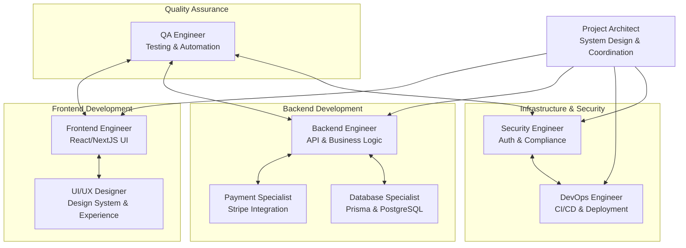
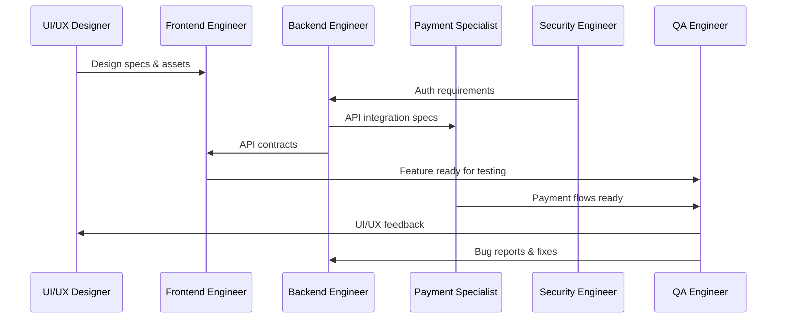

# Team Structure & Specialist Roles

## 1. Team Organization Overview

The NextJS Stripe Payment Template requires a cross-functional team of specialists working in
coordinated sprints to deliver a production-ready, secure, and scalable payment system.

### 1.1 Team Structure Diagram



### 1.2 Communication & Collaboration Model

- **Daily Standups**: 15-minute sync across all team members
- **Sprint Planning**: 2-week sprints with defined deliverables
- **Integration Points**: Weekly integration testing sessions
- **Code Reviews**: All code requires review from at least one peer
- **Architecture Reviews**: Major changes reviewed by Project Architect

## 2. Specialist Role Definitions

### 2.1 Frontend Engineer

**Primary Responsibilities:**

- Develop React/NextJS components using Shadcn UI
- Implement responsive, mobile-first design
- Create interactive payment forms and checkout flows
- Build admin dashboard and customer portal interfaces
- Optimize frontend performance and user experience

**Key Skills Required:**

- Expert in React 18+ and NextJS 14+
- Proficient with TypeScript and modern JavaScript
- Experience with Shadcn UI and Tailwind CSS
- Knowledge of form handling (React Hook Form, Zod)
- Understanding of payment UI/UX best practices

**Deliverables:**

- [ ] **Phase 1**: Core UI component library setup
  - Authentication forms (login, register, password reset)
  - Base layout components and navigation
  - Product catalog and detail pages
  - Shopping cart interface

- [ ] **Phase 2**: Payment integration frontend
  - Stripe Elements integration for card payments
  - Subscription management interface
  - Payment method management
  - Order confirmation and receipt pages

- [ ] **Phase 3**: Advanced interfaces
  - Admin dashboard with analytics charts
  - Customer portal for subscription management
  - Support ticket interface
  - Responsive design across all devices

**Dependencies:**

- UI/UX designs from Designer
- API endpoints from Backend Engineer
- Authentication flow from Security Engineer

**Code Quality Standards:**

```typescript
// Component structure example
interface ProductCardProps {
  product: Product;
  onAddToCart: (productId: string) => void;
  isLoading?: boolean;
}

export const ProductCard: React.FC<ProductCardProps> = ({
  product,
  onAddToCart,
  isLoading = false,
}) => {
  return (
    <Card className="h-full flex flex-col">
      <CardHeader>
        <CardTitle>{product.name}</CardTitle>
        <CardDescription>{product.shortDescription}</CardDescription>
      </CardHeader>
      <CardContent className="flex-1">
        {/* Component implementation */}
      </CardContent>
      <CardFooter>
        <Button
          onClick={() => onAddToCart(product.id)}
          disabled={isLoading}
          className="w-full"
        >
          {isLoading ? 'Adding...' : `Add to Cart - $${product.basePrice}`}
        </Button>
      </CardFooter>
    </Card>
  );
};
```

### 2.2 UI/UX Designer

**Primary Responsibilities:**

- Create comprehensive design system and component library
- Design user flows for authentication, purchasing, and subscription management
- Ensure accessibility compliance (WCAG 2.1 AA)
- Create responsive designs for all screen sizes
- Design dashboard interfaces for admin and customer portals

**Key Skills Required:**

- Proficiency in Figma, Adobe XD, or similar design tools
- Understanding of design systems and component libraries
- Knowledge of payment flow UX best practices
- Accessibility design principles
- Mobile-first design methodology

**Deliverables:**

- [ ] **Design System**: Complete component library in Figma
  - Colors, typography, spacing tokens
  - Button variants, form controls, cards
  - Icons and illustrations library
  - Dark mode variants

- [ ] **User Flow Designs**: Complete user journey wireframes
  - Registration and authentication flows
  - Product browsing and selection
  - Checkout and payment processes
  - Subscription management interfaces

- [ ] **High-Fidelity Mockups**: Pixel-perfect designs
  - Landing page and product catalog
  - Admin dashboard layouts
  - Customer portal interfaces
  - Email template designs

**Design Specifications:**

- **Color Palette**: Primary, secondary, neutral, and semantic colors
- **Typography**: System font stack with proper hierarchy
- **Spacing**: 4px base unit with consistent spacing scale
- **Breakpoints**: Mobile (320px), Tablet (768px), Desktop (1024px)
- **Accessibility**: WCAG 2.1 AA compliance with proper contrast ratios

### 2.3 Backend Engineer

**Primary Responsibilities:**

- Design and implement NextJS API routes
- Create business logic services and middleware
- Implement server actions for form handling
- Design database queries and optimization
- Integrate with external APIs (Stripe, Resend)

**Key Skills Required:**

- Expert in Node.js and NextJS API routes
- Strong TypeScript and JavaScript skills
- Experience with RESTful API design
- Knowledge of database design and optimization
- Understanding of microservices patterns

**Deliverables:**

- [ ] **API Foundation**: Core API structure and middleware
  - Authentication middleware and session management
  - Request validation using Zod schemas
  - Error handling and logging systems
  - Rate limiting and security middleware

- [ ] **Business Logic Services**: Core application services
  - User management service
  - Product catalog service
  - Order processing service
  - Email notification service

- [ ] **API Endpoints**: Complete REST API implementation

  ```typescript
  // Example API endpoint structure
  // app/api/products/route.ts
  export async function GET(request: NextRequest) {
    const { searchParams } = new URL(request.url);
    const page = parseInt(searchParams.get("page") || "1");
    const limit = parseInt(searchParams.get("limit") || "10");

    const products = await productService.getProducts({
      page,
      limit,
      filters: {
        status: "PUBLISHED",
        type: searchParams.get("type") as ProductType,
      },
    });

    return Response.json({
      products: products.data,
      pagination: products.pagination,
    });
  }
  ```

**Integration Points:**

- Database schema with Database Specialist
- Payment processing with Payment Specialist
- Authentication with Security Engineer
- Email services with external APIs

### 2.4 Payment Integration Specialist

**Primary Responsibilities:**

- Implement comprehensive Stripe integration
- Handle payment processing, subscriptions, and webhooks
- Ensure PCI DSS compliance
- Create payment flow optimization
- Handle complex billing scenarios (trials, discounts, refunds)

**Key Skills Required:**

- Expert knowledge of Stripe API and webhooks
- Understanding of payment processing and PCI compliance
- Experience with subscription billing models
- Knowledge of international payment methods
- Strong error handling and retry logic implementation

**Deliverables:**

- [ ] **Stripe Integration**: Complete payment processing system

  ```typescript
  // Payment service implementation
  export class PaymentService {
    private stripe: Stripe;

    constructor() {
      this.stripe = new Stripe(process.env.STRIPE_SECRET_KEY!);
    }

    async createPaymentIntent(params: CreatePaymentParams) {
      return this.stripe.paymentIntents.create({
        amount: params.amount,
        currency: params.currency,
        customer: params.customerId,
        metadata: {
          orderId: params.orderId,
          productIds: JSON.stringify(params.productIds),
        },
        automatic_payment_methods: {
          enabled: true,
        },
      });
    }

    async handleWebhook(event: Stripe.Event) {
      switch (event.type) {
        case "payment_intent.succeeded":
          await this.handlePaymentSuccess(event.data.object);
          break;
        case "customer.subscription.created":
          await this.handleSubscriptionCreated(event.data.object);
          break;
        // Additional event handlers
      }
    }
  }
  ```

- [ ] **Subscription Management**: Recurring billing system
  - Subscription creation and modification
  - Trial period management
  - Prorated billing calculations
  - Subscription lifecycle webhooks

- [ ] **Payment Security**: PCI compliant implementation
  - Secure token handling
  - Webhook signature verification
  - Payment method storage via Stripe
  - Fraud detection integration

**Compliance Requirements:**

- PCI DSS Level 1 compliance through Stripe
- No storage of sensitive payment data
- Secure webhook endpoint implementation
- Payment dispute handling procedures

### 2.5 Database Specialist

**Primary Responsibilities:**

- Design and optimize PostgreSQL database schema
- Implement Prisma ORM models and migrations
- Create efficient database queries and indexes
- Set up backup and recovery procedures
- Monitor database performance

**Key Skills Required:**

- Expert in PostgreSQL administration
- Proficiency with Prisma ORM
- Database design and normalization principles
- Query optimization and performance tuning
- Backup and disaster recovery planning

**Deliverables:**

- [ ] **Database Schema**: Complete Prisma schema implementation
  - User authentication and profile tables
  - Product catalog and pricing structures
  - Order processing and payment tracking
  - Subscription and billing tables
  - Audit logging and analytics tables

- [ ] **Performance Optimization**: Database tuning

  ```sql
  -- Critical indexes for performance
  CREATE INDEX CONCURRENTLY idx_users_email ON users(email);
  CREATE INDEX CONCURRENTLY idx_orders_user_created ON orders(user_id, created_at DESC);
  CREATE INDEX CONCURRENTLY idx_subscriptions_status_period ON subscriptions(status, current_period_end);
  ```

- [ ] **Migration Strategy**: Database versioning and deployment
  - Development to production migration pipeline
  - Data seeding for initial setup
  - Rollback procedures for failed migrations

**Performance Metrics:**

- Query response times < 100ms for 95th percentile
- Database connection pooling optimization
- Regular VACUUM and ANALYZE operations
- Monitoring slow query log

### 2.6 Security Engineer

**Primary Responsibilities:**

- Implement authentication and authorization systems
- Ensure security compliance and best practices
- Set up audit logging and security monitoring
- Conduct security reviews and penetration testing
- Implement data protection and encryption

**Key Skills Required:**

- Expert in authentication systems (BetterAuth, OAuth)
- Knowledge of security standards (OWASP, PCI DSS)
- Experience with encryption and secure data handling
- Understanding of threat modeling and risk assessment
- Penetration testing and vulnerability assessment

**Deliverables:**

- [ ] **Authentication System**: Secure user authentication

  ```typescript
  // Security configuration example
  export const authConfig = {
    database: prismaAdapter(prisma),
    emailAndPassword: {
      enabled: true,
      requireEmailVerification: true,
      minPasswordLength: 8,
      maxPasswordLength: 128,
    },
    session: {
      expiresIn: 60 * 60 * 24 * 7, // 7 days
      updateAge: 60 * 60 * 24, // 1 day
    },
    rateLimit: {
      enabled: true,
      window: 60,
      max: 100,
    },
  };
  ```

- [ ] **Authorization Framework**: Role-based access control
  - User roles and permissions system
  - API endpoint protection
  - Resource-level authorization
  - Admin impersonation controls

- [ ] **Security Monitoring**: Comprehensive audit system
  - Authentication event logging
  - Failed login attempt tracking
  - Suspicious activity detection
  - Security incident response procedures

**Security Checklist:**

- [ ] Password strength requirements enforced
- [ ] Rate limiting on authentication endpoints
- [ ] HTTPS enforced in production
- [ ] Security headers properly configured
- [ ] Input validation and sanitization
- [ ] SQL injection prevention
- [ ] XSS protection mechanisms
- [ ] CSRF token implementation

### 2.7 DevOps Engineer

**Primary Responsibilities:**

- Set up CI/CD pipelines and deployment automation
- Configure production infrastructure on LeaseWeb
- Implement monitoring and logging systems
- Manage environment configurations and secrets
- Optimize application performance and scaling

**Key Skills Required:**

- Experience with GitHub Actions and CI/CD
- Knowledge of Docker and containerization
- Understanding of cloud infrastructure (LeaseWeb)
- Monitoring and observability tools
- Performance optimization and caching strategies

**Deliverables:**

- [ ] **CI/CD Pipeline**: Automated deployment system

  ```yaml
  # .github/workflows/deploy.yml
  name: Deploy to Production
  on:
    push:
      branches: [main]

  jobs:
    test:
      runs-on: ubuntu-latest
      steps:
        - uses: actions/checkout@v3
        - name: Setup Node.js
          uses: actions/setup-node@v3
          with:
            node-version: "18"
        - name: Install dependencies
          run: npm ci
        - name: Run tests
          run: npm run test
        - name: Run Playwright tests
          run: npm run test:e2e

    deploy:
      needs: test
      runs-on: ubuntu-latest
      steps:
        - name: Deploy to LeaseWeb
          run: ./scripts/deploy.sh
  ```

- [ ] **Infrastructure Setup**: Production environment configuration
  - Docker containerization for consistent deployments
  - PostgreSQL database setup and configuration
  - SSL certificate management
  - Domain and DNS configuration

- [ ] **Monitoring & Logging**: Observability stack
  - Application performance monitoring
  - Error tracking and alerting
  - Database performance monitoring
  - Security event monitoring

**Infrastructure Components:**

- **Web Server**: Nginx reverse proxy
- **Application**: Node.js/NextJS in Docker
- **Database**: PostgreSQL with automated backups
- **Caching**: Redis for session storage
- **Monitoring**: Prometheus/Grafana stack
- **Logging**: Centralized logging with ELK stack

### 2.8 QA Engineer

**Primary Responsibilities:**

- Develop comprehensive test strategy and test plans
- Create automated test suites using Playwright
- Perform manual testing of critical user flows
- Test payment integrations in sandbox environments
- Validate security and performance requirements

**Key Skills Required:**

- Experience with automated testing (Playwright, Jest)
- Knowledge of payment system testing
- Understanding of API testing and validation
- Manual testing and exploratory testing skills
- Performance and load testing experience

**Deliverables:**

- [ ] **Test Strategy**: Comprehensive testing approach
  - Unit test coverage requirements (>90%)
  - Integration test scenarios
  - End-to-end user journey testing
  - Payment flow testing procedures

- [ ] **Automated Test Suite**: Complete test automation

  ```typescript
  // Example E2E test
  import { test, expect } from "@playwright/test";

  test("complete purchase flow", async ({ page }) => {
    await page.goto("/products");

    // Select product
    await page.click('[data-testid="product-card"]:first-child');
    await page.click('[data-testid="add-to-cart"]');

    // Proceed to checkout
    await page.click('[data-testid="cart-icon"]');
    await page.click('[data-testid="checkout-button"]');

    // Fill payment details (test mode)
    await page.fill('[data-testid="card-number"]', "4242424242424242");
    await page.fill('[data-testid="card-expiry"]', "12/25");
    await page.fill('[data-testid="card-cvc"]', "123");

    // Complete payment
    await page.click('[data-testid="pay-button"]');

    // Verify success
    await expect(page.locator('[data-testid="success-message"]')).toBeVisible();
  });
  ```

- [ ] **Security Testing**: Vulnerability assessment
  - Authentication flow security testing
  - Payment security validation
  - Input validation and XSS testing
  - Rate limiting verification

**Testing Coverage:**

- **Unit Tests**: 90%+ code coverage for business logic
- **Integration Tests**: All API endpoints tested
- **E2E Tests**: Critical user journeys automated
- **Performance Tests**: Load testing for 1000+ concurrent users
- **Security Tests**: OWASP Top 10 vulnerability testing

## 3. Team Coordination & Workflows

### 3.1 Sprint Planning Process

**Sprint Duration**: 2 weeks

**Sprint Ceremonies**:

- **Sprint Planning** (Monday Week 1): 2 hours
- **Daily Standups**: 15 minutes daily
- **Sprint Review** (Friday Week 2): 1 hour
- **Sprint Retrospective** (Friday Week 2): 1 hour

**Definition of Ready**:

- [ ] User story has clear acceptance criteria
- [ ] Dependencies identified and resolved
- [ ] Technical approach agreed upon
- [ ] Designs completed (if UI work)
- [ ] Story sized and estimated

**Definition of Done**:

- [ ] Code reviewed and approved
- [ ] Unit tests written and passing
- [ ] Integration tests passing
- [ ] Documentation updated
- [ ] Security review completed
- [ ] Deployed to staging environment
- [ ] QA testing completed

### 3.2 Code Review Process

**Review Requirements**:

- Minimum 1 reviewer for non-critical changes
- Minimum 2 reviewers for security-related changes
- Project Architect approval for architectural changes
- All automated tests must pass before review

**Review Checklist**:

- [ ] Code follows established patterns and conventions
- [ ] Security considerations addressed
- [ ] Performance impact considered
- [ ] Error handling implemented
- [ ] Tests provide adequate coverage
- [ ] Documentation updated

### 3.3 Integration Points & Handoffs



### 3.4 Risk Mitigation & Dependencies

**Critical Dependencies**:

1. **Design System** → Frontend Development
2. **Authentication System** → All API Development
3. **Database Schema** → Backend Development
4. **Payment Integration** → Frontend Checkout
5. **Security Review** → Production Deployment

**Risk Mitigation Strategies**:

- **Parallel Development**: Independent components developed simultaneously
- **Mock Services**: Use mocks during development to avoid blocking
- **Regular Integration**: Daily builds with integration testing
- **Spike Solutions**: Prototype complex integrations early
- **Knowledge Sharing**: Regular tech talks and documentation

### 3.5 Communication Protocols

**Daily Communication**:

- Slack channels for team coordination
- GitHub for code reviews and discussions
- Figma for design collaboration
- Notion for documentation and planning

**Weekly Communication**:

- Technical architecture reviews
- Cross-team integration planning
- Security and compliance checkpoints
- Performance and testing reviews

**Escalation Procedures**:

- **Technical Issues**: Escalate to Project Architect
- **Security Concerns**: Escalate to Security Engineer
- **Timeline Risks**: Escalate to Project Manager
- **Quality Issues**: Escalate to QA Engineer

## 4. Team Success Metrics

### 4.1 Individual Performance Metrics

**Frontend Engineer**:

- Component reusability score (>80%)
- Page load performance (< 3 seconds)
- Accessibility compliance (WCAG 2.1 AA)
- Code review feedback quality

**Backend Engineer**:

- API response times (< 500ms average)
- Code coverage (>90% for business logic)
- API security compliance
- Database query performance

**Payment Specialist**:

- Payment success rate (>99%)
- Webhook processing reliability
- PCI compliance adherence
- Payment dispute resolution time

**Security Engineer**:

- Security vulnerability resolution time
- Authentication system uptime
- Security audit completion rate
- Incident response time

### 4.2 Team Collaboration Metrics

- Sprint velocity consistency
- Code review cycle time
- Integration success rate
- Cross-team communication effectiveness
- Knowledge sharing participation

### 4.3 Project Success Criteria

- [ ] All functional requirements delivered
- [ ] Security audit passed with no critical issues
- [ ] Performance benchmarks met
- [ ] 99.9% uptime achieved in production
- [ ] Customer satisfaction scores >4.5/5
- [ ] Template adoption rate targets met

This comprehensive team structure ensures that each specialist role has clear responsibilities,
deliverables, and integration points while maintaining effective collaboration and communication
throughout the project lifecycle.
