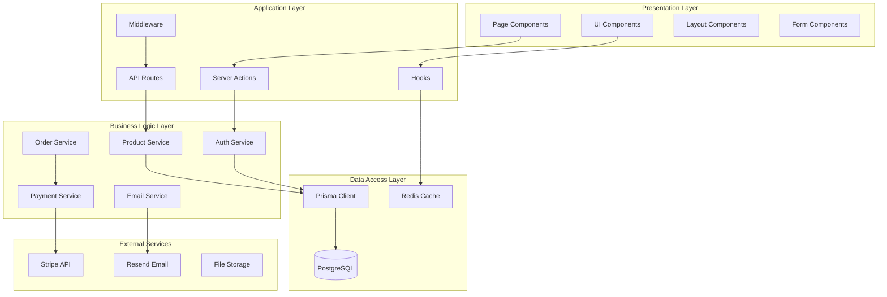
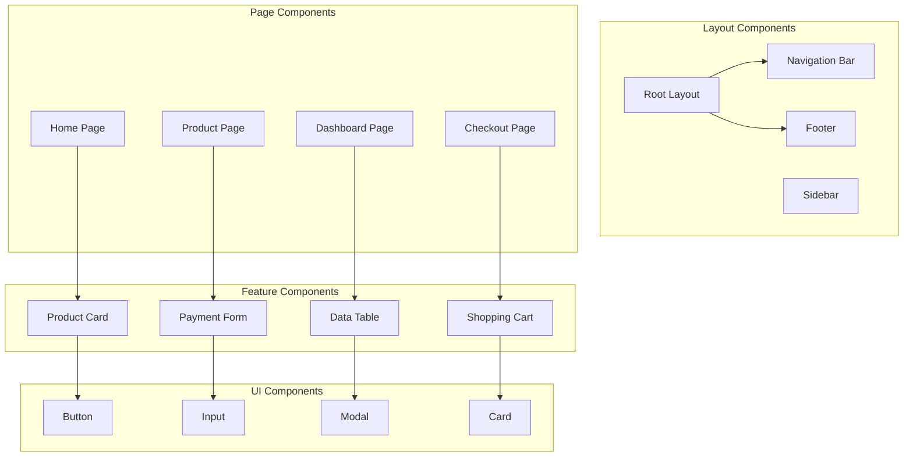

# Component Architecture & Technical Breakdown

## 1. Component Architecture Overview

The NextJS Stripe Payment Template follows a modular, layered architecture with clear separation
between frontend components, backend services, and external integrations.

### 1.1 Architecture Layers



### 1.2 Directory Structure

```
src/
├── app/                          # NextJS App Router
│   ├── (auth)/                   # Authentication routes group
│   │   ├── login/
│   │   ├── register/
│   │   └── reset-password/
│   ├── (dashboard)/              # Dashboard routes group
│   │   ├── admin/
│   │   ├── customer/
│   │   └── support/
│   ├── api/                      # API routes
│   │   ├── auth/
│   │   ├── products/
│   │   ├── orders/
│   │   ├── subscriptions/
│   │   ├── payments/
│   │   └── webhooks/
│   ├── products/                 # Public product pages
│   ├── checkout/                 # Checkout flow
│   └── globals.css
├── components/                   # Reusable UI components
│   ├── ui/                      # Shadcn UI components
│   ├── auth/                    # Authentication components
│   ├── dashboard/               # Dashboard components
│   ├── payment/                 # Payment components
│   ├── product/                 # Product components
│   └── layout/                  # Layout components
├── lib/                         # Core utilities and services
│   ├── auth.ts                  # Authentication configuration
│   ├── prisma.ts                # Database client
│   ├── stripe.ts                # Stripe configuration
│   ├── email.ts                 # Email service
│   ├── validation.ts            # Zod schemas
│   └── utils.ts                 # Utility functions
├── hooks/                       # Custom React hooks
├── actions/                     # Server actions
├── middleware.ts                # Next.js middleware
└── types/                       # TypeScript type definitions
```

## 2. Frontend Component Architecture

### 2.1 Component Hierarchy



### 2.2 Core UI Components

#### 2.2.1 Base UI Components (Shadcn UI)

```typescript
// components/ui/button.tsx
import * as React from "react"
import { Slot } from "@radix-ui/react-slot"
import { cva, type VariantProps } from "class-variance-authority"
import { cn } from "@/lib/utils"

const buttonVariants = cva(
  "inline-flex items-center justify-center whitespace-nowrap rounded-md text-sm font-medium transition-colors focus-visible:outline-none focus-visible:ring-1 focus-visible:ring-ring disabled:pointer-events-none disabled:opacity-50",
  {
    variants: {
      variant: {
        default: "bg-primary text-primary-foreground shadow hover:bg-primary/90",
        destructive: "bg-destructive text-destructive-foreground shadow-sm hover:bg-destructive/90",
        outline: "border border-input bg-background shadow-sm hover:bg-accent hover:text-accent-foreground",
        secondary: "bg-secondary text-secondary-foreground shadow-sm hover:bg-secondary/80",
        ghost: "hover:bg-accent hover:text-accent-foreground",
        link: "text-primary underline-offset-4 hover:underline",
      },
      size: {
        default: "h-9 px-4 py-2",
        sm: "h-8 rounded-md px-3 text-xs",
        lg: "h-10 rounded-md px-8",
        icon: "h-9 w-9",
      },
    },
    defaultVariants: {
      variant: "default",
      size: "default",
    },
  }
)

export interface ButtonProps
  extends React.ButtonHTMLAttributes<HTMLButtonElement>,
    VariantProps<typeof buttonVariants> {
  asChild?: boolean
}

export const Button = React.forwardRef<HTMLButtonElement, ButtonProps>(
  ({ className, variant, size, asChild = false, ...props }, ref) => {
    const Comp = asChild ? Slot : "button"
    return (
      <Comp
        className={cn(buttonVariants({ variant, size, className }))}
        ref={ref}
        {...props}
      />
    )
  }
)
```

#### 2.2.2 Product Components

```typescript
// components/product/ProductCard.tsx
import { Product, Price } from '@prisma/client'
import { Card, CardHeader, CardTitle, CardDescription, CardContent, CardFooter } from '@/components/ui/card'
import { Button } from '@/components/ui/button'
import { Badge } from '@/components/ui/badge'
import { formatCurrency } from '@/lib/utils'
import { useCart } from '@/hooks/use-cart'

interface ProductWithPrices extends Product {
  prices: Price[]
}

interface ProductCardProps {
  product: ProductWithPrices
  showAddToCart?: boolean
  size?: 'sm' | 'md' | 'lg'
}

export const ProductCard: React.FC<ProductCardProps> = ({
  product,
  showAddToCart = true,
  size = 'md',
}) => {
  const { addItem, isLoading } = useCart()

  const handleAddToCart = async () => {
    const defaultPrice = product.prices.find(p => p.active) || product.prices[0]
    await addItem({
      productId: product.id,
      priceId: defaultPrice.id,
      quantity: 1,
    })
  }

  return (
    <Card className={cn(
      "h-full flex flex-col transition-all duration-200 hover:shadow-lg",
      size === 'sm' && "max-w-sm",
      size === 'lg' && "max-w-lg"
    )}>
      <CardHeader className="pb-4">
        <div className="flex items-start justify-between">
          <div className="space-y-1">
            <CardTitle className="text-lg font-semibold line-clamp-2">
              {product.name}
            </CardTitle>
            <CardDescription className="line-clamp-2">
              {product.shortDescription}
            </CardDescription>
          </div>
          {product.featured && (
            <Badge variant="secondary">Featured</Badge>
          )}
        </div>

        {product.images && JSON.parse(product.images as string).length > 0 && (
          <div className="aspect-video relative overflow-hidden rounded-md bg-muted">
            
          </div>
        )}
      </CardHeader>

      <CardContent className="flex-1 pt-0">
        <div className="space-y-2">
          <div className="flex items-center justify-between">
            <span className="text-2xl font-bold">
              {formatCurrency(Number(product.basePrice))}
            </span>
            <Badge variant={product.type === 'SUBSCRIPTION' ? 'default' : 'outline'}>
              {product.type === 'SUBSCRIPTION' ? 'Monthly' : 'One-time'}
            </Badge>
          </div>

          {product.trialDays && product.trialDays > 0 && (
            <p className="text-sm text-muted-foreground">
              {product.trialDays}-day free trial
            </p>
          )}
        </div>
      </CardContent>

      {showAddToCart && (
        <CardFooter className="pt-4">
          <Button
            onClick={handleAddToCart}
            disabled={isLoading || product.status !== 'PUBLISHED'}
            className="w-full"
            size={size === 'sm' ? 'sm' : 'default'}
          >
            {isLoading ? 'Adding...' : 'Add to Cart'}
          </Button>
        </CardFooter>
      )}
    </Card>
  )
}
```

#### 2.2.3 Payment Components

```typescript
// components/payment/StripePaymentForm.tsx
import { useState } from 'react'
import { useStripe, useElements, CardElement } from '@stripe/react-stripe-js'
import { Button } from '@/components/ui/button'
import { Card, CardHeader, CardTitle, CardContent } from '@/components/ui/card'
import { Alert, AlertDescription } from '@/components/ui/alert'
import { Loader2 } from 'lucide-react'

interface StripePaymentFormProps {
  clientSecret: string
  onSuccess: (paymentIntent: any) => void
  onError: (error: string) => void
  amount: number
  currency: string
}

export const StripePaymentForm: React.FC<StripePaymentFormProps> = ({
  clientSecret,
  onSuccess,
  onError,
  amount,
  currency,
}) => {
  const stripe = useStripe()
  const elements = useElements()
  const [isProcessing, setIsProcessing] = useState(false)
  const [error, setError] = useState<string | null>(null)

  const handleSubmit = async (event: React.FormEvent) => {
    event.preventDefault()

    if (!stripe || !elements) {
      return
    }

    setIsProcessing(true)
    setError(null)

    const cardElement = elements.getElement(CardElement)

    if (!cardElement) {
      setError('Card element not found')
      setIsProcessing(false)
      return
    }

    try {
      const { error, paymentIntent } = await stripe.confirmCardPayment(clientSecret, {
        payment_method: {
          card: cardElement,
          billing_details: {
            // Add billing details if available
          },
        },
      })

      if (error) {
        setError(error.message || 'Payment failed')
        onError(error.message || 'Payment failed')
      } else if (paymentIntent) {
        onSuccess(paymentIntent)
      }
    } catch (err) {
      setError('An unexpected error occurred')
      onError('An unexpected error occurred')
    } finally {
      setIsProcessing(false)
    }
  }

  return (
    <Card>
      <CardHeader>
        <CardTitle>Payment Details</CardTitle>
      </CardHeader>
      <CardContent>
        <form onSubmit={handleSubmit} className="space-y-4">
          <div className="p-4 border rounded-md">
            <CardElement
              options={{
                style: {
                  base: {
                    fontSize: '16px',
                    color: '#424770',
                    '::placeholder': {
                      color: '#aab7c4',
                    },
                  },
                },
                hidePostalCode: false,
              }}
            />
          </div>

          {error && (
            <Alert variant="destructive">
              <AlertDescription>{error}</AlertDescription>
            </Alert>
          )}

          <div className="flex items-center justify-between py-4 border-t">
            <div>
              <p className="text-sm text-muted-foreground">Total</p>
              <p className="text-2xl font-bold">
                {new Intl.NumberFormat('en-US', {
                  style: 'currency',
                  currency: currency.toUpperCase(),
                }).format(amount / 100)}
              </p>
            </div>

            <Button
              type="submit"
              disabled={!stripe || isProcessing}
              className="min-w-32"
            >
              {isProcessing ? (
                <>
                  <Loader2 className="mr-2 h-4 w-4 animate-spin" />
                  Processing...
                </>
              ) : (
                'Pay Now'
              )}
            </Button>
          </div>
        </form>
      </CardContent>
    </Card>
  )
}
```

### 2.3 Custom Hooks

#### 2.3.1 Authentication Hook

```typescript
// hooks/use-auth.ts
import { useEffect, useState } from "react";
import { User } from "@/types/auth";

interface AuthState {
  user: User | null;
  isLoading: boolean;
  isAuthenticated: boolean;
}

export const useAuth = () => {
  const [state, setState] = useState<AuthState>({
    user: null,
    isLoading: true,
    isAuthenticated: false,
  });

  useEffect(() => {
    fetchCurrentUser();
  }, []);

  const fetchCurrentUser = async () => {
    try {
      const response = await fetch("/api/auth/me");
      if (response.ok) {
        const { user } = await response.json();
        setState({
          user,
          isLoading: false,
          isAuthenticated: !!user,
        });
      } else {
        setState({
          user: null,
          isLoading: false,
          isAuthenticated: false,
        });
      }
    } catch (error) {
      setState({
        user: null,
        isLoading: false,
        isAuthenticated: false,
      });
    }
  };

  const login = async (credentials: LoginCredentials) => {
    const response = await fetch("/api/auth/login", {
      method: "POST",
      headers: { "Content-Type": "application/json" },
      body: JSON.stringify(credentials),
    });

    if (response.ok) {
      await fetchCurrentUser();
      return { success: true };
    } else {
      const error = await response.json();
      return { success: false, error: error.message };
    }
  };

  const logout = async () => {
    await fetch("/api/auth/logout", { method: "POST" });
    setState({
      user: null,
      isLoading: false,
      isAuthenticated: false,
    });
  };

  const register = async (userData: RegisterData) => {
    const response = await fetch("/api/auth/register", {
      method: "POST",
      headers: { "Content-Type": "application/json" },
      body: JSON.stringify(userData),
    });

    if (response.ok) {
      return { success: true };
    } else {
      const error = await response.json();
      return { success: false, error: error.message };
    }
  };

  return {
    ...state,
    login,
    logout,
    register,
    refetch: fetchCurrentUser,
  };
};
```

#### 2.3.2 Shopping Cart Hook

```typescript
// hooks/use-cart.ts
import { create } from "zustand";
import { persist } from "zustand/middleware";

interface CartItem {
  productId: string;
  priceId: string;
  quantity: number;
  product?: Product;
  price?: Price;
}

interface CartStore {
  items: CartItem[];
  isLoading: boolean;
  addItem: (item: Omit<CartItem, "quantity"> & { quantity?: number }) => Promise<void>;
  removeItem: (productId: string, priceId: string) => void;
  updateQuantity: (productId: string, priceId: string, quantity: number) => void;
  clearCart: () => void;
  getTotalItems: () => number;
  getTotalAmount: () => number;
}

export const useCart = create<CartStore>()(
  persist(
    (set, get) => ({
      items: [],
      isLoading: false,

      addItem: async (newItem) => {
        set({ isLoading: true });

        try {
          // Fetch product and price details if not provided
          if (!newItem.product || !newItem.price) {
            const [productRes, priceRes] = await Promise.all([
              fetch(`/api/products/${newItem.productId}`),
              fetch(`/api/prices/${newItem.priceId}`),
            ]);

            const [product, price] = await Promise.all([productRes.json(), priceRes.json()]);

            newItem.product = product;
            newItem.price = price;
          }

          set((state) => {
            const existingItem = state.items.find(
              (item) => item.productId === newItem.productId && item.priceId === newItem.priceId
            );

            if (existingItem) {
              return {
                items: state.items.map((item) =>
                  item.productId === newItem.productId && item.priceId === newItem.priceId
                    ? { ...item, quantity: item.quantity + (newItem.quantity || 1) }
                    : item
                ),
                isLoading: false,
              };
            } else {
              return {
                items: [...state.items, { ...newItem, quantity: newItem.quantity || 1 }],
                isLoading: false,
              };
            }
          });
        } catch (error) {
          console.error("Failed to add item to cart:", error);
          set({ isLoading: false });
        }
      },

      removeItem: (productId, priceId) =>
        set((state) => ({
          items: state.items.filter(
            (item) => !(item.productId === productId && item.priceId === priceId)
          ),
        })),

      updateQuantity: (productId, priceId, quantity) =>
        set((state) => ({
          items:
            quantity > 0
              ? state.items.map((item) =>
                  item.productId === productId && item.priceId === priceId
                    ? { ...item, quantity }
                    : item
                )
              : state.items.filter(
                  (item) => !(item.productId === productId && item.priceId === priceId)
                ),
        })),

      clearCart: () => set({ items: [] }),

      getTotalItems: () => {
        const { items } = get();
        return items.reduce((total, item) => total + item.quantity, 0);
      },

      getTotalAmount: () => {
        const { items } = get();
        return items.reduce((total, item) => {
          const price = item.price?.unitAmount || 0;
          return total + Number(price) * item.quantity;
        }, 0);
      },
    }),
    {
      name: "shopping-cart",
      partialize: (state) => ({ items: state.items }), // Only persist items
    }
  )
);
```

## 3. Backend Service Architecture

### 3.1 Service Layer Structure

```typescript
// lib/services/base.service.ts
export abstract class BaseService {
  protected abstract model: any;
  protected abstract relations?: string[];

  async findById(id: string, include?: Record<string, boolean>) {
    return this.model.findUnique({
      where: { id },
      include: include || this.getDefaultIncludes(),
    });
  }

  async findMany(params: FindManyParams) {
    const { page = 1, limit = 10, where, orderBy } = params;
    const skip = (page - 1) * limit;

    const [data, total] = await Promise.all([
      this.model.findMany({
        where,
        orderBy,
        skip,
        take: limit,
        include: this.getDefaultIncludes(),
      }),
      this.model.count({ where }),
    ]);

    return {
      data,
      pagination: {
        page,
        limit,
        total,
        totalPages: Math.ceil(total / limit),
      },
    };
  }

  protected getDefaultIncludes(): Record<string, boolean> {
    return (
      this.relations?.reduce(
        (acc, relation) => {
          acc[relation] = true;
          return acc;
        },
        {} as Record<string, boolean>
      ) || {}
    );
  }
}
```

### 3.2 Product Service

```typescript
// lib/services/product.service.ts
import { prisma } from "@/lib/prisma";
import { BaseService } from "./base.service";
import { ProductType, ProductStatus } from "@prisma/client";

interface CreateProductParams {
  name: string;
  description: string;
  shortDescription?: string;
  type: ProductType;
  basePrice: number;
  billingInterval?: string;
  trialDays?: number;
  images?: string[];
  categoryIds?: string[];
}

interface ProductFilters {
  type?: ProductType;
  status?: ProductStatus;
  categoryId?: string;
  featured?: boolean;
  search?: string;
  priceRange?: {
    min?: number;
    max?: number;
  };
}

export class ProductService extends BaseService {
  protected model = prisma.product;
  protected relations = ["prices", "categories"];

  async createProduct(params: CreateProductParams, userId: string) {
    const product = await prisma.product.create({
      data: {
        name: params.name,
        description: params.description,
        shortDescription: params.shortDescription,
        slug: await this.generateSlug(params.name),
        type: params.type,
        basePrice: params.basePrice,
        billingInterval: params.billingInterval,
        trialDays: params.trialDays,
        images: JSON.stringify(params.images || []),
        status: "DRAFT",
        categories: params.categoryIds
          ? {
              connect: params.categoryIds.map((id) => ({ id })),
            }
          : undefined,
      },
      include: this.getDefaultIncludes(),
    });

    // Create default price
    await this.createDefaultPrice(product.id, params.basePrice, params.type);

    // Audit log
    await this.auditLog("PRODUCT_CREATED", userId, product.id);

    return product;
  }

  async findProducts(filters: ProductFilters = {}, pagination = { page: 1, limit: 10 }) {
    const where: any = {};

    if (filters.type) where.type = filters.type;
    if (filters.status) where.status = filters.status;
    if (filters.featured !== undefined) where.featured = filters.featured;

    if (filters.search) {
      where.OR = [
        { name: { contains: filters.search, mode: "insensitive" } },
        { description: { contains: filters.search, mode: "insensitive" } },
      ];
    }

    if (filters.priceRange) {
      const { min, max } = filters.priceRange;
      where.basePrice = {};
      if (min !== undefined) where.basePrice.gte = min;
      if (max !== undefined) where.basePrice.lte = max;
    }

    if (filters.categoryId) {
      where.categories = {
        some: { id: filters.categoryId },
      };
    }

    return this.findMany({
      where,
      orderBy: [{ featured: "desc" }, { createdAt: "desc" }],
      ...pagination,
    });
  }

  async publishProduct(id: string, userId: string) {
    const product = await prisma.product.update({
      where: { id },
      data: {
        status: "PUBLISHED",
        publishedAt: new Date(),
      },
      include: this.getDefaultIncludes(),
    });

    await this.auditLog("PRODUCT_PUBLISHED", userId, id);
    return product;
  }

  private async generateSlug(name: string): Promise<string> {
    const baseSlug = name
      .toLowerCase()
      .replace(/[^a-z0-9]+/g, "-")
      .replace(/^-+|-+$/g, "");

    let slug = baseSlug;
    let counter = 1;

    while (await prisma.product.findUnique({ where: { slug } })) {
      slug = `${baseSlug}-${counter}`;
      counter++;
    }

    return slug;
  }

  private async createDefaultPrice(productId: string, amount: number, type: ProductType) {
    // Integration with Stripe to create price
    const stripePrice = await stripe.prices.create({
      unit_amount: Math.round(amount * 100),
      currency: "usd",
      product_data: { name: `Price for ${productId}` },
      recurring: type === "SUBSCRIPTION" ? { interval: "month" } : undefined,
    });

    return prisma.price.create({
      data: {
        productId,
        stripePriceId: stripePrice.id,
        unitAmount: amount,
        type: type === "SUBSCRIPTION" ? "RECURRING" : "ONE_TIME",
        recurring: type === "SUBSCRIPTION" ? { interval: "month" } : null,
      },
    });
  }

  private async auditLog(action: string, userId: string, resourceId: string) {
    await prisma.auditLog.create({
      data: {
        action,
        resource: "product",
        resourceId,
        userId,
      },
    });
  }
}

export const productService = new ProductService();
```

### 3.3 Order Service

```typescript
// lib/services/order.service.ts
import { prisma } from "@/lib/prisma";
import { paymentService } from "./payment.service";
import { emailService } from "./email.service";

interface CreateOrderParams {
  userId: string;
  items: Array<{
    productId: string;
    priceId: string;
    quantity: number;
  }>;
  billingAddress: any;
  shippingAddress?: any;
  discountCode?: string;
}

export class OrderService {
  async createOrder(params: CreateOrderParams) {
    return prisma.$transaction(async (tx) => {
      // Generate order number
      const orderNumber = await this.generateOrderNumber();

      // Calculate totals
      const { subtotal, taxAmount, discountAmount, totalAmount, items } =
        await this.calculateOrderTotals(params.items, params.discountCode);

      // Create order
      const order = await tx.order.create({
        data: {
          userId: params.userId,
          orderNumber,
          status: "PENDING",
          subtotal,
          taxAmount,
          discountAmount,
          totalAmount,
          billingAddress: JSON.stringify(params.billingAddress),
          shippingAddress: params.shippingAddress ? JSON.stringify(params.shippingAddress) : null,
          items: {
            create: items.map((item) => ({
              productId: item.productId,
              priceId: item.priceId,
              quantity: item.quantity,
              unitPrice: item.unitPrice,
              totalPrice: item.totalPrice,
            })),
          },
        },
        include: {
          items: {
            include: {
              product: true,
              price: true,
            },
          },
          user: true,
        },
      });

      // Process discount usage
      if (params.discountCode) {
        await this.recordDiscountUsage(params.discountCode, params.userId, order.id);
      }

      // Create payment intent for non-subscription items
      const oneTimeItems = items.filter((item) => item.type === "ONE_TIME");
      if (oneTimeItems.length > 0) {
        const paymentIntent = await paymentService.createPaymentIntent({
          amount: Math.round(totalAmount * 100),
          currency: "usd",
          customerId: order.user.stripeCustomerId,
          orderId: order.id,
          userEmail: order.user.email,
        });

        await tx.order.update({
          where: { id: order.id },
          data: { stripePaymentIntentId: paymentIntent.id },
        });
      }

      return order;
    });
  }

  async completeOrder(orderId: string) {
    const order = await prisma.order.update({
      where: { id: orderId },
      data: {
        status: "COMPLETED",
        completedAt: new Date(),
      },
      include: {
        items: {
          include: {
            product: true,
          },
        },
        user: true,
      },
    });

    // Generate download URLs for digital products
    const downloadUrls = await this.generateDownloadUrls(order.items);

    // Send confirmation email
    await emailService.sendOrderConfirmation(order);

    return { order, downloadUrls };
  }

  private async generateOrderNumber(): Promise<string> {
    const now = new Date();
    const year = now.getFullYear();
    const month = String(now.getMonth() + 1).padStart(2, "0");

    const count = await prisma.order.count({
      where: {
        createdAt: {
          gte: new Date(year, now.getMonth(), 1),
          lt: new Date(year, now.getMonth() + 1, 1),
        },
      },
    });

    return `ORD-${year}${month}-${String(count + 1).padStart(4, "0")}`;
  }

  private async calculateOrderTotals(
    items: Array<{ productId: string; priceId: string; quantity: number }>,
    discountCode?: string
  ) {
    // Fetch product and price details
    const itemDetails = await Promise.all(
      items.map(async (item) => {
        const [product, price] = await Promise.all([
          prisma.product.findUnique({ where: { id: item.productId } }),
          prisma.price.findUnique({ where: { id: item.priceId } }),
        ]);

        if (!product || !price) {
          throw new Error(`Product or price not found`);
        }

        const unitPrice = Number(price.unitAmount);
        const totalPrice = unitPrice * item.quantity;

        return {
          ...item,
          product,
          price,
          unitPrice,
          totalPrice,
          type: price.type,
        };
      })
    );

    const subtotal = itemDetails.reduce((sum, item) => sum + item.totalPrice, 0);

    // Calculate tax (simplified - in production, use tax service)
    const taxAmount = subtotal * 0.08; // 8% tax rate

    // Apply discount
    let discountAmount = 0;
    if (discountCode) {
      discountAmount = await this.calculateDiscount(discountCode, subtotal);
    }

    const totalAmount = subtotal + taxAmount - discountAmount;

    return {
      subtotal,
      taxAmount,
      discountAmount,
      totalAmount,
      items: itemDetails,
    };
  }

  private async calculateDiscount(code: string, subtotal: number): Promise<number> {
    const discount = await prisma.discount.findUnique({
      where: { code },
    });

    if (!discount || !discount.active) {
      return 0;
    }

    // Check validity period
    const now = new Date();
    if (discount.validFrom && discount.validFrom > now) return 0;
    if (discount.validUntil && discount.validUntil < now) return 0;

    // Check usage limits
    if (discount.maxUses && discount.currentUses >= discount.maxUses) return 0;

    // Check minimum amount
    if (discount.minimumAmount && subtotal < Number(discount.minimumAmount)) return 0;

    // Calculate discount amount
    if (discount.type === "PERCENTAGE") {
      return subtotal * (Number(discount.value) / 100);
    } else {
      return Math.min(Number(discount.value), subtotal);
    }
  }

  private async recordDiscountUsage(code: string, userId: string, orderId: string) {
    const discount = await prisma.discount.findUnique({
      where: { code },
    });

    if (discount) {
      await Promise.all([
        prisma.discountUsage.create({
          data: {
            discountId: discount.id,
            userId,
            orderId,
            amountSaved: 0, // Will be updated after calculation
          },
        }),
        prisma.discount.update({
          where: { id: discount.id },
          data: { currentUses: { increment: 1 } },
        }),
      ]);
    }
  }

  private async generateDownloadUrls(orderItems: any[]) {
    const digitalItems = orderItems.filter((item) => item.product.type === "DIGITAL_DOWNLOAD");

    return Promise.all(
      digitalItems.map(async (item) => {
        // Generate secure, time-limited download URL
        const token = crypto.randomUUID();
        const expiresAt = new Date(Date.now() + 24 * 60 * 60 * 1000); // 24 hours

        return {
          productId: item.productId,
          url: `/api/downloads/${token}`,
          expiresAt,
        };
      })
    );
  }
}

export const orderService = new OrderService();
```

### 3.4 Server Actions

```typescript
// actions/auth.actions.ts
"use server";

import { z } from "zod";
import { redirect } from "next/navigation";
import { auth } from "@/lib/auth";
import { userService } from "@/lib/services/user.service";
import { loginSchema, registerSchema } from "@/lib/validation/auth";

export async function loginAction(values: z.infer<typeof loginSchema>) {
  try {
    const validatedData = loginSchema.parse(values);

    const result = await auth.api.signIn("credentials", {
      email: validatedData.email,
      password: validatedData.password,
      redirect: false,
    });

    if (result?.error) {
      return { error: result.error };
    }

    return { success: true };
  } catch (error) {
    return { error: "Invalid credentials" };
  }
}

export async function registerAction(values: z.infer<typeof registerSchema>) {
  try {
    const validatedData = registerSchema.parse(values);

    const existingUser = await userService.findByEmail(validatedData.email);
    if (existingUser) {
      return { error: "User already exists" };
    }

    await userService.createUser(validatedData);

    return { success: true, message: "Registration successful. Please check your email." };
  } catch (error) {
    return { error: "Registration failed" };
  }
}

export async function logoutAction() {
  await auth.api.signOut();
  redirect("/login");
}
```

## 4. Integration Layer

### 4.1 Stripe Service Integration

```typescript
// lib/services/stripe.service.ts
import Stripe from "stripe";
import { prisma } from "@/lib/prisma";

export class StripeService {
  private stripe: Stripe;

  constructor() {
    this.stripe = new Stripe(process.env.STRIPE_SECRET_KEY!, {
      apiVersion: "2024-06-20",
    });
  }

  async createCustomer(user: any) {
    const customer = await this.stripe.customers.create({
      email: user.email,
      name: user.name,
      metadata: {
        userId: user.id,
      },
    });

    await prisma.user.update({
      where: { id: user.id },
      data: { stripeCustomerId: customer.id },
    });

    return customer;
  }

  async syncProductToStripe(product: any) {
    const stripeProduct = await this.stripe.products.create({
      name: product.name,
      description: product.description,
      images: product.images ? JSON.parse(product.images) : [],
      metadata: {
        productId: product.id,
      },
    });

    return stripeProduct;
  }

  async handleWebhook(signature: string, payload: string) {
    const event = this.stripe.webhooks.constructEvent(
      payload,
      signature,
      process.env.STRIPE_WEBHOOK_SECRET!
    );

    switch (event.type) {
      case "payment_intent.succeeded":
        await this.handlePaymentSuccess(event.data.object as Stripe.PaymentIntent);
        break;
      case "customer.subscription.created":
        await this.handleSubscriptionCreated(event.data.object as Stripe.Subscription);
        break;
      case "invoice.payment_failed":
        await this.handlePaymentFailed(event.data.object as Stripe.Invoice);
        break;
      default:
        console.log(`Unhandled event type: ${event.type}`);
    }

    return { received: true };
  }

  private async handlePaymentSuccess(paymentIntent: Stripe.PaymentIntent) {
    const order = await prisma.order.findUnique({
      where: { stripePaymentIntentId: paymentIntent.id },
    });

    if (order) {
      await orderService.completeOrder(order.id);
    }
  }

  private async handleSubscriptionCreated(subscription: Stripe.Subscription) {
    // Handle subscription creation logic
    console.log("Subscription created:", subscription.id);
  }

  private async handlePaymentFailed(invoice: Stripe.Invoice) {
    // Handle payment failure logic
    console.log("Payment failed for invoice:", invoice.id);
  }
}

export const stripeService = new StripeService();
```

This component architecture provides a comprehensive foundation for building the NextJS Stripe
Payment Template with clear separation of concerns, reusable components, and maintainable service
layers.
